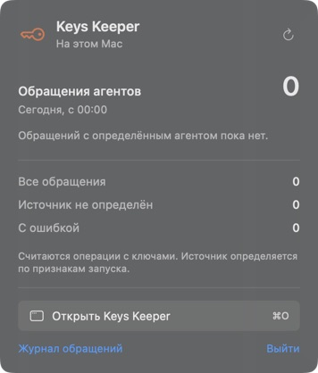

# Native macOS companion

The key icon in the macOS menu bar shows today's attributed agent operations.
Click it to open the activity panel. The panel opens and hides the existing
Keys Keeper admin in its own window; hiding preserves the current page and
unfinished input. Closing the window keeps the menu bar app running.



## Install

Requires macOS 13+, an installed Keys Keeper Python runtime, and Xcode or Xcode
command-line tools to build the native binary. No Node.js, Rust, Electron, or
additional Python packages are required.

```sh
keys app install --menubar
# To replace an existing, recognized Keys Keeper shortcut:
keys app install --menubar --force
```

Open `~/Applications/Keys Keeper.app`. The first launch shows the activity
panel. While the app is running, launching it again from Spotlight shows the
vault window. In the active app, Command-O shows/hides the window and
Command-Shift-K opens the statistics panel. Command-Q quits the companion and
its own local server. The legacy `keys app install` shortcut remains available.

The builder stages and signs a complete app before replacing an existing
bundle. It refuses symlinks and unrelated bundle identifiers. The bundle
includes the Python package snapshot and records the existing interpreter and
vault-home paths; rebuild after moving/removing that interpreter or changing
the desired vault location. The app is locally ad-hoc signed, not notarized for
distribution to other Macs.

## What the numbers mean

- A recorded `copy`, `inject`, `resolve`, `ssh`, `reveal`, or `export` counts as
  one operation, including failed operations. A multi-key resolve is one
  operation, not a count of the secret values used.
- The interval starts at local midnight, respecting the Mac's timezone and
  daylight saving changes. The panel updates every 15 seconds and on opening.
- All local profile journals and relevant UTC-month archives are included.
  Remote-machine activity is not fetched.
- Agent attribution uses fixed names from known executable identities or
  Codex/Claude Code environment hints. These hints are display metadata, not
  proof of identity or an authorization mechanism. Session IDs, environment
  values, working directories, and process arguments are not recorded.
- Old shell-only events remain under “Источник не определён”. Desktop activity
  is marked explicitly and takes precedence over inherited agent hints.
- Missing journals mean no recorded activity. Corrupt or unreadable journals
  are marked incomplete. The projection never opens the credentials backend,
  rewrites historical logs, or creates a missing vault.
- The metric covers instrumented audit events, not every possible underlying
  backend read. Metadata listing and editing are excluded from access counts.

`keys audit --summary` returns the same value-free daily projection as JSON.
The web audit endpoint returns the newest events before applying its limit,
so old history cannot crowd today's records out of the default journal view.

## Process boundary

The native AppKit/SwiftUI process owns a Python bridge via private stdin/stdout
pipes. Statistics carry only counts and timestamps. Opening the vault starts
an app-owned admin listener on an OS-selected loopback port. Its capability
URL is passed directly to an ephemeral WebKit data store; it is not saved in
`serve-url`, printed to logs, or placed in process arguments. Navigation stays
on that server's exact origin. EOF/quit ends that server without interacting
with a separately running `keys serve` instance.

## Validation

```sh
pytest -q tests/test_desktop_stats.py tests/test_desktop_bridge.py \
  tests/test_menubar_install.py tests/test_audit.py tests/test_server_api.py \
  tests/test_app_install.py tests/test_serve_url.py
```

The bridge integration check uses an empty temporary vault and verifies
unauthorized HTTP refusal, cookie bootstrap, no URL handoff file, and shutdown
on stdin EOF. Statistics tests cover local midnight, DST, month archives,
profiles, caller attribution, malformed data, and absence of secret-bearing
fields in the result. Installer tests verify failure preserves the old app.
