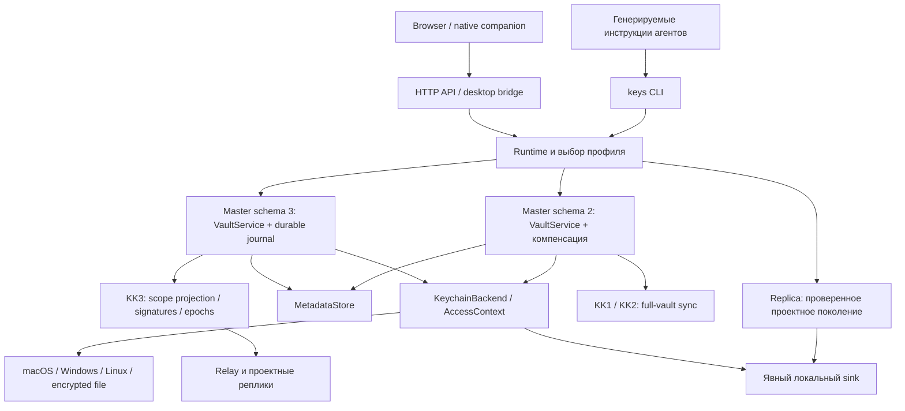

# Архитектурное ревью Keys Keeper 0.11.1

Дата: 2 октября 2026 года. Проверенный исходный коммит: `36df576ba403437d6352add265232bc01601cbae`.

Это исходное ревью до исправлений. Актуальные изменения, границы скоупа и
проверки описаны в [отчёте об исправлениях](HARDENING-2026-10-02.md).

## Вывод

Keys Keeper вырос в полноценный продукт: инструкции для агентов, кроссплатформенный CLI, несколько способов хранения, локальный HTTP-интерфейс, desktop-компаньон, синхронизация, выдача проектных профилей и восстановление. Основные границы новой архитектуры продуманы хорошо. Особенно сильны явное разделение master/replica, запрет неявного экспорта schema 3 через старый протокол, криптографически проверяемые проектные поколения и тестирование сбоев.

Основной риск — разные гарантии на разных путях выполнения. Новый проектный контур часто строгий, а legacy-команды и часть UI продолжают пользоваться менее строгими реализациями. Есть воспроизведённые дефекты целостности и ложного успеха, которые стоит исправить до следующего расширения возможностей.

Выделены **13 пунктов: 3 P1 и 10 P2**. P1 означает первую очередь исправления из-за риска неполной резервной копии, неправильной привязки учётных данных или недостаточной защиты файлов. P2 — воспроизведённая проблема надёжности либо существенный эксплуатационный риск. Windows-пункт подтверждён анализом реализации и правилами ОС; доступ другого пользователя в реальной Windows-среде здесь не воспроизводился. Прочие архитектурные рекомендации отделены от дефектов.

Полная перепись продукта не требуется. Наибольшую пользу даст перенос уже существующих строгих контрактов на остальные команды и сокращение числа независимых реализаций одной операции.

## Что именно проверено

Ревью выполнено в checkout `/Users/viacheslavkuznetsov/Desktop/Projects/skills/keys-keeper-skill/keys-keeper-tag-directory`, ветка `main`, версия `0.11.1`. Во время проверки удалённая `refs/heads/main` указывала на тот же коммит. Соседний checkout `keys-keeper-skill` содержал более старую ветку и локальные изменения; его состояние не использовалось как состояние текущего продукта.

В охват вошли инструкции и их генераторы, модель записей и ссылок, metadata store, backend-адаптеры, CLI, journal/recovery, KK1/KK2/KK3, personal sync, проектные профили, HTTP-маршруты, браузерный интерфейс, native bridge, updater, упаковка и CI. Выполнена инвентаризация всех Python-модулей; углублённо проверены границы чтения, записи, авторизации, публикации и восстановления. Это не утверждение о построчной проверке каждого файла.

| Проверка | Результат и предел доказательства |
|---|---|
| Размер исходников | 314 отслеживаемых файлов, 81 Python-модуль, 28 214 физических строк Python |
| Тестовая база | 110 файлов, 1 112 определений тестов; локальная коллекция — 1 582 случая с параметризацией |
| Выбранный локальный прогон | 309 тестов прошли за 13,82 с; Python 3.12.11, pytest 9.1.1, cryptography 48.0.1 |
| Дополнительные проверки дефектов | 22 синтетические пробы, включая schema 2/3, настоящий encrypted-file backend, принудительное завершение дочернего процесса и настоящий loopback HTTP-сервер |
| CI точного коммита | Пять комбинаций ОС/Python завершились успешно; опубликованный combined-coverage manifest соответствует исходному SHA |
| Покрытие Python | 14 755 / 17 304 исполняемых строк — **85,27%**; 4 029 / 5 596 ветвей — **72,00%**; 81 модуль, пропущенных модулей нет |
| Релиз | Опубликован `v0.11.1`; receipt содержит тот же source SHA и метрики. Фактическая установленная у пользователя версия отдельно не проверялась |

Проверены [CI tests](https://github.com/kyzdes/keys-keeper-skill/actions/runs/36997726907), [CI updater regression](https://github.com/kyzdes/keys-keeper-skill/actions/runs/36997726935) и [релиз v0.11.1](https://github.com/kyzdes/keys-keeper-skill/releases/tag/v0.11.1). Основная матрица: macOS/Python 3.12, Windows/3.12, Ubuntu/3.10, Ubuntu/3.12 и Ubuntu/3.14. На Ubuntu/3.12 предусмотрена обязательная реальная Secret Service-проверка; платформенные тесты запускаются там, где применимы. Это не означает, что все 1 582 случая исполняются без пропусков на каждой ОС.

Исходный код продукта не изменялся. Все дополнительные данные и секреты были синтетическими. Рабочий vault пользователя, login keychain и clipboard не читались. Реальный доступ через Windows DACL, физическое энергопотребление и полное прохождение native UI пользователем не проверялись.

Исходные доказательства и воспроизводящий скрипт сохранены в [каталоге evidence](/Users/viacheslavkuznetsov/Desktop/Projects/skills/keys-keeper-skill/keys-keeper-tag-directory/docs/architecture/review-evidence-2026-10-02/README.md).

## Как устроена архитектура сейчас

**Инструкции — декларативный контракт.** Короткий генерируемый `SKILL.md` задаёт безопасную поверхность команд и отправляет к шести тематическим references. Источники — `agent_rules/canonical.py` и `render.py`. Генерация и проверка одинакового содержимого для разных упаковок значительно лучше независимого редактирования нескольких копий.

**Runtime — точка композиции.** Он выбирает профиль, роль, пути, backend и service. Для replica используется отдельное представление синхронизированных данных. Отказ от создания master-backend при работе с replica — важная реальная граница, а не только инструкция агенту.

**Storage разделён на metadata и секреты.** `KeychainBackend` даёт небольшой интерфейс `get/set/delete/list_ids`; `Sealed` защищает от случайного вывода через `str/repr`. Метаданные хранятся отдельно, поэтому discovery не должен читать значения. Schema 3 добавляет catalog, distribution, revisions, publication intents и восстановление операций.

**Синхронизация имеет три поколения.** KK1 обслуживает legacy encrypted snapshot/S3 и WebVault. KK2 добавляет подписанный full-vault контур и членство устройств. KK3 обслуживает проектные scope, проверяемые поколения, enrollment, rekey и replica submissions. Personal sync строится поверх отдельного явно выбранного KK3 scope, включая текущие и будущие записи.

**UI и фоновые процессы — дополнительные адаптеры.** Loopback HTTP, native bridge, обновления и автоматическая синхронизация должны пользоваться теми же правилами, что и CLI. Сейчас именно на этих стыках чаще всего расходятся контракты.

## Что сделано хорошо

1. **Модель угроз сформулирована честно.** В skill и backend явно сказано: `Sealed` уменьшает случайное раскрытие в transcript, но любой код того же OS-пользователя может вызвать `unseal()`. Clipboard и файлы признаны exposure surfaces. Нет ложной гарантии изоляции от произвольного кода под тем же пользователем. Это правильная основа для дальнейшего проектирования broker, если такая изоляция станет требованием. Источники: [skill](https://github.com/kyzdes/keys-keeper-skill/blob/36df576ba403437d6352add265232bc01601cbae/skills/keys-keeper/SKILL.md#L12), [backend](https://github.com/kyzdes/keys-keeper-skill/blob/36df576ba403437d6352add265232bc01601cbae/src/keys_keeper/backend.py#L14).

2. **Режимы доступа заданы явно.** `INTERACTIVE`, `UI_FORBIDDEN` и `ACL_PREPARATION` различают действие пользователя, фоновые процессы и изменение ACL. Это лучше глобального переключателя, который случайно разрешает системные диалоги любому потребителю. Platform factory и тесты readiness создают проверяемую точку политики. Источник: [composition](https://github.com/kyzdes/keys-keeper-skill/blob/36df576ba403437d6352add265232bc01601cbae/src/keys_keeper/composition.py).

3. **Schema 3 действительно улучшает целостность.** Для master mutations есть encrypted before/after images, durable journal и восстановление. Старые full-vault сериализаторы отказываются работать со schema 3 до чтения секретов. Проектный preview не требует backend, а включение связанных записей задаётся явно. Эти решения предотвращают случайную публикацию всего master vault. Источники: [master journal](https://github.com/kyzdes/keys-keeper-skill/blob/36df576ba403437d6352add265232bc01601cbae/src/keys_keeper/master_journal.py), [legacy guard](https://github.com/kyzdes/keys-keeper-skill/blob/36df576ba403437d6352add265232bc01601cbae/src/keys_keeper/sync.py#L89), [project projection](https://github.com/kyzdes/keys-keeper-skill/blob/36df576ba403437d6352add265232bc01601cbae/src/keys_keeper/project_projection.py).

4. **Криптографические протоколы имеют строгие границы.** Публичные идентификаторы, scope binding, signatures, checkpoints, pinned authority и проверки wire-format дают конкретные инварианты. KK3 rekey при отзыве устройства решает отдельную задачу будущего доступа. Независимые vectors и отрицательные тесты полезнее одного успешного encrypt/decrypt round trip. Источники: [KK3 protocol](https://github.com/kyzdes/keys-keeper-skill/blob/36df576ba403437d6352add265232bc01601cbae/src/keys_keeper/project_protocol.py), [KK2 protocol](https://github.com/kyzdes/keys-keeper-skill/blob/36df576ba403437d6352add265232bc01601cbae/src/keys_keeper/sync_protocol_v2.py), [protocol contract](https://github.com/kyzdes/keys-keeper-skill/blob/36df576ba403437d6352add265232bc01601cbae/docs/architecture/PROJECT-PROTOCOL-CONTRACT.md).

5. **Есть реальная инженерия отказов.** Private durable-file IO ограничивает размеры, отвергает symlink/нерегулярные файлы и использует атомарные замены. HTTP ограничивает тела, чтение и число обработчиков. Native bridge использует private pipes, ограниченные кадры, ephemeral WebKit и проверки origin; предусмотрена уборка процессов. Это существенные меры, хотя единообразие реализации ещё неполное. Источники: [private files](https://github.com/kyzdes/keys-keeper-skill/blob/36df576ba403437d6352add265232bc01601cbae/src/keys_keeper/private_files.py), [HTTP resources](https://github.com/kyzdes/keys-keeper-skill/blob/36df576ba403437d6352add265232bc01601cbae/src/keys_keeper/http_resources.py), [desktop bridge](https://github.com/kyzdes/keys-keeper-skill/blob/36df576ba403437d6352add265232bc01601cbae/src/keys_keeper/desktop_bridge.py).

6. **Новые оптимизации сохраняют проверку данных.** Encrypted-file backend перечитывает и аутентифицирует свежий ciphertext, а не бессрочно доверяет plaintext cache. Фоновые показатели построены по metadata-only audit. Синтетическая проверка project idle: 6 scope × 3 цикла, 0 journal writes, 0 изменённых encrypted files, 6 KDF derivations — по одной холодной на scope. Проверка desktop stats: 100 refresh после прогрева на 10 000 строках — 0 full scans и 0 parsed records; при добавлении 10 строк разобраны только эти 10. Это подтверждает уменьшение лишней работы, но не измеряет расход батареи. Источники и receipts: [efficiency](https://github.com/kyzdes/keys-keeper-skill/blob/36df576ba403437d6352add265232bc01601cbae/docs/PROJECT-SYNC-EFFICIENCY.md), [project benchmark](/Users/viacheslavkuznetsov/Desktop/Projects/skills/keys-keeper-skill/keys-keeper-tag-directory/docs/architecture/review-evidence-2026-10-02/project-idle.json), [stats benchmark](/Users/viacheslavkuznetsov/Desktop/Projects/skills/keys-keeper-skill/keys-keeper-tag-directory/docs/architecture/review-evidence-2026-10-02/desktop-stats.json).

7. **CI и release evidence существенно сильнее обычной проверки unit tests.** Есть реальные OS-адаптеры, несколько версий Python, wheel smoke, отдельные updater regressions, полный список покрываемых модулей и ограничения интерпретации coverage. Проверки упаковки и стабильная установка личного Codex skill уменьшают риск зависимости от случайного versioned plugin-cache path. Это хороший фундамент, который стоит сохранить.

## Проблемы по приоритетам

### F01 · P1 · Legacy export и snapshot скрывают отказ чтения секрета

**Где:** [sync.py:77](https://github.com/kyzdes/keys-keeper-skill/blob/36df576ba403437d6352add265232bc01601cbae/src/keys_keeper/sync.py#L77), [cli.py:821](https://github.com/kyzdes/keys-keeper-skill/blob/36df576ba403437d6352add265232bc01601cbae/src/keys_keeper/cli.py#L821), [sync_vps.py:867](https://github.com/kyzdes/keys-keeper-skill/blob/36df576ba403437d6352add265232bc01601cbae/src/keys_keeper/sync_vps.py#L867).

`_safe_secret()` превращает любой `KeychainError` в `None`. `cmd_export()` ещё шире: подавляет любой `Exception` при чтении основного секрета и passphrase. В результате «значение отсутствует», «пользователь отказал», «backend недоступен» и «код сломался» превращаются в одинаковый snapshot.

**Подтверждено:** у существующей API-key записи с синтетическим значением backend отказывает в чтении. Snapshot содержит `_secret: null`; export создаёт encrypted blob, сообщает успех и возвращает `0`. KK2 использует тот же snapshot builder. Schema 3 через этот путь запрещена, поэтому находка относится к legacy full-vault export/sync.

**Последствие:** резервная копия или новое устройство могут оказаться без нужного секрета. При слиянии с уже существующим устройством может сохраниться старое значение; нельзя обещать, что неполный snapshot автоматически удаляет все локальные секреты. Главная проблема — ложный успех и потеря достоверности backup/sync.

**Исправление:** различить `SecretNotFound`, `SecretAccessDenied`, `BackendUnavailable` и неожиданный сбой; явно определить, у каких entry types секрет обязателен. Отсутствующая необязательная passphrase допустима, отказ доступа — ошибка всей операции до публикации. Использовать уже существующий fail-closed подход проектной projection. Partial export, если он нужен продукту, должен быть отдельным явным режимом с перечнем пропусков.

**Критерий приёмки:** отказ чтения обязательного секрета даёт ненулевой exit/error receipt; output/remote не изменяются; отсутствующая необязательная passphrase корректно экспортируется; неожиданное исключение не превращается в успешный backup.

### F02 · P1 · Переименование ломает ссылки и позволяет незаметную перепривязку

**Где:** [store.py:149](https://github.com/kyzdes/keys-keeper-skill/blob/36df576ba403437d6352add265232bc01601cbae/src/keys_keeper/store.py#L149), [service.py:184](https://github.com/kyzdes/keys-keeper-skill/blob/36df576ba403437d6352add265232bc01601cbae/src/keys_keeper/service.py#L184), [master_journal.py:143](https://github.com/kyzdes/keys-keeper-skill/blob/36df576ba403437d6352add265232bc01601cbae/src/keys_keeper/master_journal.py#L143), [cli.py:516](https://github.com/kyzdes/keys-keeper-skill/blob/36df576ba403437d6352add265232bc01601cbae/src/keys_keeper/cli.py#L516).

References адресуют записи по изменяемому `name`. Store при rename обновляет только индекс имени; service и schema-3 journal не меняют входящие ссылки. В schema 3 `dependents_before/after` у update остаются пустыми.

**Подтверждено в schema 2 и 3:** server ссылается на `old-key`; после rename ключа в `new-key` server сохраняет `old-key`, а resolution падает. Если создать другую запись с именем `old-key`, прежний server без собственного изменения начинает ссылаться на другой entry ID.

**Последствие:** сначала неработающий SSH/auth flow, затем потенциально использование других учётных данных. Это дефект referential integrity, а не косметическое несовпадение названий. Browser edit form делает имя `readonly`; основной воспроизведённый путь — service/CLI rename.

**Исправление:** ближайшее безопасное решение — запретить rename при dependents с понятным metadata-only сообщением. Полное решение — атомарно переписать входящие references, revisions и publication intents; journal должен содержать все before/after dependent images. Долгосрочно предпочтительны references по immutable entry ID с отдельным display name и явной миграцией формата.

**Критерий приёмки:** rename связанного ключа либо явно отклонён без изменений, либо сохраняет правильную связь во всех scope; повторное использование старого имени не меняет идентичность target. Crash injection должен проверять target вместе с зависимыми записями.

### F03 · P1 · На Windows owner-only контракт файлов не обеспечивается самим кодом

**Где:** [secure_io.py:23](https://github.com/kyzdes/keys-keeper-skill/blob/36df576ba403437d6352add265232bc01601cbae/src/keys_keeper/secure_io.py#L23), [secure_io.py:143](https://github.com/kyzdes/keys-keeper-skill/blob/36df576ba403437d6352add265232bc01601cbae/src/keys_keeper/secure_io.py#L143), [private_files.py:17](https://github.com/kyzdes/keys-keeper-skill/blob/36df576ba403437d6352add265232bc01601cbae/src/keys_keeper/private_files.py#L17), [paths.py:121](https://github.com/kyzdes/keys-keeper-skill/blob/36df576ba403437d6352add265232bc01601cbae/src/keys_keeper/paths.py#L121), [replica unlock write](https://github.com/kyzdes/keys-keeper-skill/blob/36df576ba403437d6352add265232bc01601cbae/src/keys_keeper/project_runtime.py#L898).

Проверка владельца и закрытых permissions выполняется только на POSIX. На Windows создаваемые файлы и tempfile не получают явную защищённую DACL. Это важно для plaintext inject/resolve sinks и replica unlock material: ключ разблокировки профиля хранится отдельным файлом и используется для расшифровки состояния.

Windows по умолчанию наследует DACL родителя, а Python `chmod` на Windows управляет read-only flag и не задаёт POSIX-подобную приватность. Следовательно, приватность нельзя вывести из аргумента `0600` или имени helper. Основание: [Microsoft: file security and access rights](https://learn.microsoft.com/en-us/windows/win32/fileio/file-security-and-access-rights), [Python: os.chmod](https://docs.python.org/3.10/library/os.html#os.chmod).

**Граница доказательства:** кодовый пробел подтверждён. Реальная межпользовательская утечка на Windows здесь не воспроизводилась. Обычный закрытый пользовательский каталог может иметь корректные ACL от ОС. Риск появляется при shared/custom home, широких ACL родителя или замене ранее защищённого файла новым tempfile с другими inherited permissions. Windows Credential Manager сам по себе этой находкой не объявляется небезопасным.

**Исправление:** добавить платформенный private-file primitive с явной owner/current-user SID policy и protected DACL до записи секретных байтов; проверять существующие файлы/каталоги. Определить поддерживаемую политику SYSTEM/administrators, не обещая защиты от локального администратора. Общий helper должен обслуживать sinks, unlock material и private state.

**Критерий приёмки:** настоящий Windows-тест с широкими inherited ACL проверяет DACL нового и заменённого файла, owner SID и отказ при небезопасном существующем состоянии; добавить случай Unicode username. Текущая зелёная матрица не заменяет этот тест: CLI sink fixture зависит от macOS test keychain, а permission assertions условны для POSIX.

### F04 · P2 · Завершённый journal растёт без lifecycle и удорожает recovery

**Где:** [operation_journal.py:192](https://github.com/kyzdes/keys-keeper-skill/blob/36df576ba403437d6352add265232bc01601cbae/src/keys_keeper/operation_journal.py#L192), [recovery scan](https://github.com/kyzdes/keys-keeper-skill/blob/36df576ba403437d6352add265232bc01601cbae/src/keys_keeper/operation_journal.py#L222), [limits](https://github.com/kyzdes/keys-keeper-skill/blob/36df576ba403437d6352add265232bc01601cbae/src/keys_keeper/operation_journal.py#L35), [cache invalidation](https://github.com/kyzdes/keys-keeper-skill/blob/36df576ba403437d6352add265232bc01601cbae/src/keys_keeper/operation_journal.py#L391), [service recovery](https://github.com/kyzdes/keys-keeper-skill/blob/36df576ba403437d6352add265232bc01601cbae/src/keys_keeper/project_runtime.py#L354).

`finish()` записывает terminal status и убирает pending marker, но сохраняет `.enc` с прежним `state`, включая before/after секретов. `list_unfinished()` сканирует все records, включая completed. Общие ограничения — 10 000 records и 512 MiB. Изменение journal сбрасывает terminal manifest; cold recovery либо recovery после изменения снова аутентифицирует всю историю. В неизменившемся живом объекте повторные KDF избегаются, но чтение и hashing истории остаются.

**Подтверждено:** 4 completed records, 0 pending; при моделировании cap = 3 recovery отклоняется. Это проверка логики границы, а не запуск 10 001 production-операции. На 8 completed records cold recovery сделал 8 KDF и занял 1,31 с; повторный неизменившийся recovery — 0 KDF; после девятой записи recovery сделал 8 KDF и занял 1,31 с. Время относится к этому Mac и синтетическим данным, переносить его линейно на все среды нельзя.

**Последствие:** обычная история изменений постепенно замедляет операции и в конечном счёте может заблокировать recovery/service даже без незавершённых операций. Сохранение старых секретов в encrypted history также требует осознанной retention policy: удаление текущей записи не означает исчезновение всех её локальных исторических копий.

**Исправление:** спроектировать authenticated terminal checkpoint/compaction с проверяемым соответствием актуальному состоянию и crash-safe удалением ненужных before/after images. Разделить recovery queue и исторические receipts. Сохранить обнаружение unindexed unfinished operations; нельзя просто довериться metadata-only pending index или отключить authentication ради скорости. Задать retention, метрики размера/возраста и предупреждение до cap.

**Критерий приёмки:** длительная последовательность завершённых мутаций не увеличивает recovery cost без ограничения; crash на каждом этапе compaction не теряет pending operation; corrupt terminal/pending state продолжает приводить к отказу. Проверка должна также доказывать, что удаление завершённой истории следует принятой политике хранения секретов.

### F05 · P2 · Schema 2 по-прежнему допускает рассогласование при падении процесса

**Где:** [RuntimeContext.service](https://github.com/kyzdes/keys-keeper-skill/blob/36df576ba403437d6352add265232bc01601cbae/src/keys_keeper/project_runtime.py#L350), [legacy compensation](https://github.com/kyzdes/keys-keeper-skill/blob/36df576ba403437d6352add265232bc01601cbae/src/keys_keeper/service.py#L118), [update path](https://github.com/kyzdes/keys-keeper-skill/blob/36df576ba403437d6352add265232bc01601cbae/src/keys_keeper/service.py#L184).

Для schema 2 runtime создаёт `VaultService` без durable manager. Undo работает при обрабатываемом исключении, но не при завершении процесса между backend write и metadata commit. Schema 3 имеет другой контракт и этой находкой не объявляется сломанной.

**Подтверждено:** дочерний процесс с настоящим encrypted-file backend завершён через `os._exit(77)` после записи нового значения. После перезапуска backend содержит новое синтетическое значение, metadata — старую note. Все paths и пароль были изолированы.

**Исправление:** принять явное продуктовое решение о legacy: перенести durable mutation contract на standalone vault либо предложить поддерживаемую migration/deprecation policy. Надёжность обычных save/rotate не должна случайно зависеть от того, настроил ли пользователь project sync. Автоматическая миграция без проверенного backup и понятного rollback не рекомендуется.

**Критерий приёмки:** kill/crash между backend и metadata для поддерживаемого standalone режима оставляет либо прежнее состояние, либо восстановимую операцию; нет неопределённой смеси. Если schema 2 остаётся временно, её ограничение должно быть явно описано как ограничение текущего режима.

### F06 · P2 · Legacy export обходит безопасные file primitives

**Где:** [cli.py:835](https://github.com/kyzdes/keys-keeper-skill/blob/36df576ba403437d6352add265232bc01601cbae/src/keys_keeper/cli.py#L835), [import read](https://github.com/kyzdes/keys-keeper-skill/blob/36df576ba403437d6352add265232bc01601cbae/src/keys_keeper/cli.py#L853).

`Path.write_bytes()` следует symlink и сразу перезаписывает существующий target. Нет общего no-follow/ownership preflight, atomic publication и read-back verification. Import читает произвольный файл целиком до size preflight.

**Подтверждено:** export в синтетический symlink перезаписал его сторонний target и вернул `0`. Получившийся mode был `0644` в данной среде. Сам blob зашифрован, поэтому этот mode не доказывает раскрытие plaintext; доказанный риск — неожиданная перезапись и менее надёжный backup IO.

**Исправление:** использовать общий bounded private-file IO, no-follow и regular-file checks, same-directory atomic write/fsync; явно определить допустимость перезаписи готового backup. Проверить формат и ciphertext read-back до success receipt. На import проверять размер до полного чтения и дорогой обработки.

**Критерий приёмки:** symlink/нерегулярный target отвергается без изменения; crash не оставляет усечённую единственную копию; oversized import отклоняется до KDF/JSON; existing backup меняется только согласно явному контракту overwrite.

### F07 · P2 · inject не обеспечивает корректный dotenv-контракт

**Где:** [cli.py:343](https://github.com/kyzdes/keys-keeper-skill/blob/36df576ba403437d6352add265232bc01601cbae/src/keys_keeper/cli.py#L343).

Запись формируется как `ENV=value` без валидации имени и правил сериализации значения. `--replace` меняет только первое совпадение.

**Подтверждено:** файл с двумя `MY_KEY=` после replace сохраняет старое последнее присваивание; newline в `--as` принят и создаёт две строки; multiline secret создаёт дополнительное присваивание. Exit во всех трёх случаях — `0`.

**Последствие:** потребитель, использующий последнее присваивание, продолжит получать старое значение; multiline credentials и специальное содержимое могут менять смысл конфигурации. Конкретная сторонняя dotenv-библиотека не запускалась: доказаны записанные строки, а интерпретация зависит от потребителя. Это не самостоятельное доказательство shell execution.

**Исправление:** до обращения к backend валидировать ENV по `^[A-Za-z_][A-Za-z0-9_]*$`; определить поддерживаемый dotenv dialect, quoting/escaping либо явно отклонять неподдерживаемые значения. Для duplicates — отказ или явно оговорённая нормализация всех присваиваний. Для произвольного template resolve отдельно описать, что он не является универсальным encoder для JSON/YAML/shell.

**Критерий приёмки:** невалидное имя отвергается без secret read; duplicate assignment не оставляет неоднозначную конфигурацию; supported multiline/special values round-trip в выбранном формате либо отклоняются до записи.

### F08 · P2 · resolve продолжает secret reads после отказа авторизации

**Где:** [cli.py:408](https://github.com/kyzdes/keys-keeper-skill/blob/36df576ba403437d6352add265232bc01601cbae/src/keys_keeper/cli.py#L408), [skill stop rule](https://github.com/kyzdes/keys-keeper-skill/blob/36df576ba403437d6352add265232bc01601cbae/skills/keys-keeper/SKILL.md#L28).

Callback для regex substitution ловит ошибку, добавляет её в список и продолжает проход. Повторные placeholders одного имени заново вызывают `backend.get()`, а следующие credentials читаются после первого отказа.

**Подтверждено:** template с двумя placeholders отказавшего ключа и одним другим вызвал reads `[blocked, blocked, later]`, вернул `1` и не записал audit event. Target при этом не переписывается — это полезная уже существующая гарантия.

**Последствие:** CLI не соблюдает собственное требование «остановить credential operation после одной неудачной авторизации». Interactive backend может вызвать повторные системные диалоги. В пробе проверены попытки чтения, реальные dialogs не вызывались.

**Исправление:** заранее разобрать уникальные references, проверить metadata-only ошибки, читать каждое нужное значение один раз на операцию и немедленно останавливаться на access-denied/unavailable. Формировать один безопасный failure receipt/audit event. Не вводить бессрочный plaintext cache.

**Критерий приёмки:** после первого authorization failure дополнительных secret reads нет; одинаковые placeholders используют одно чтение; target не меняется; failure отражён без значения секрета и без сырого backend exception text.

### F09 · P2 · HTTP JSON и ошибки обрабатываются неединообразно

**Где:** [route dispatch](https://github.com/kyzdes/keys-keeper-skill/blob/36df576ba403437d6352add265232bc01601cbae/src/keys_keeper/api.py#L114), [copy parse](https://github.com/kyzdes/keys-keeper-skill/blob/36df576ba403437d6352add265232bc01601cbae/src/keys_keeper/api.py#L562), [create parse](https://github.com/kyzdes/keys-keeper-skill/blob/36df576ba403437d6352add265232bc01601cbae/src/keys_keeper/api.py#L636), [patch parse](https://github.com/kyzdes/keys-keeper-skill/blob/36df576ba403437d6352add265232bc01601cbae/src/keys_keeper/api.py#L675).

Основной dispatch защищает создание context, но не выполнение всех route handlers. В нескольких handlers `json.loads()` стоит вне validation boundary. Строгость нового personal API и старого entry API различается. Неизвестные поля могут быть проигнорированы без ошибки.

**Подтверждено через настоящий loopback HTTP:** authenticated POST `/api/entries` с body `{` завершает соединение без структурированного `400`. Проба `_patch_entry` с неподдерживаемым `name` получает `200`, хотя имя не меняется. Browser form намеренно делает имя read-only; это пример нестрогого API schema, а не утверждение о поломанном UI rename.

**Исправление:** один строгий JSON parser с проверкой object type, duplicates, допустимых полей и размеров; явные request DTO для каждого endpoint. Общий boundary преобразует ожидаемые validation/domain errors в фиксированный response, неожиданные сбои — в безопасный server-error response с correlation ID. Не ослаблять существующую authentication до parsing/dispatch.

**Критерий приёмки:** invalid JSON, scalar/list body, duplicate keys, wrong types и unknown fields получают предсказуемый 4xx, процесс и соединение сохраняют корректный протокол; неожиданный backend сбой не отдаёт traceback или необработанный exception пользователю.

### F10 · P2 · Форма создания note расходится с доменной моделью

**Где:** [note form](https://github.com/kyzdes/keys-keeper-skill/blob/36df576ba403437d6352add265232bc01601cbae/src/keys_keeper/static/app.js#L831), [payload fields](https://github.com/kyzdes/keys-keeper-skill/blob/36df576ba403437d6352add265232bc01601cbae/src/keys_keeper/static/app.js#L864), [required fields](https://github.com/kyzdes/keys-keeper-skill/blob/36df576ba403437d6352add265232bc01601cbae/src/keys_keeper/models.py#L41).

Frontend отправляет `fields.body`, но модель требует `fields.secret_body`. Form serializer этот флаг не добавляет.

**Подтверждено:** payload, соответствующий полям текущей формы, передан настоящему API handler и получил `400`; запись не создана. Полное браузерное нажатие кнопки не воспроизводилось, но конкретное несовпадение serializer/model и HTTP-результат проверены.

**Исправление:** явно задать public-note contract (`secret_body: false`) либо предложить отдельный режим sensitive note, где body идёт через secret sink (`secret_body: true`). Не удалять доменную проверку ради обхода ошибки. Общая схема entry types должна задавать обязательные поля для CLI и UI.

**Критерий приёмки:** форма → HTTP → storage для каждого поддерживаемого entry type; public note успешно создаётся, sensitive note не сохраняет body в публичной metadata. Отдельно проверить редактирование и round trip.

### F11 · P2 · Итог операции и audit могут противоречить друг другу

**Где:** [inject success](https://github.com/kyzdes/keys-keeper-skill/blob/36df576ba403437d6352add265232bc01601cbae/src/keys_keeper/cli.py#L374), [resolve failures](https://github.com/kyzdes/keys-keeper-skill/blob/36df576ba403437d6352add265232bc01601cbae/src/keys_keeper/cli.py#L433), [recent events](https://github.com/kyzdes/keys-keeper-skill/blob/36df576ba403437d6352add265232bc01601cbae/src/keys_keeper/api.py#L553), [audit search](https://github.com/kyzdes/keys-keeper-skill/blob/36df576ba403437d6352add265232bc01601cbae/src/keys_keeper/audit.py#L311).

После успешной записи sink команда вызывает audit. Если audit не записался, исключение выходит наружу, хотя side effect уже совершён. В другом направлении resolve с отказом чтения не отражается в audit. Успешный resolve привязывает событие к `<file>`, поэтому поиск конкретного credential не даёт полной истории его использования. `recent_events` запрашивает `limit=5` без `newest_first=True`, получая первые события.

**Подтверждено:** искусственная ошибка audit после inject оставила записанный файл, но команда завершилась исключением без success receipt. Для семи событий API вернул индексы `0..4`, а не последние `6..2`. Отсутствие failed resolve audit также проверено.

**Исправление:** определить `OperationResult` с `committed`, `outcome`, `audit_status` и operation ID. Явно выбрать политику при audit failure до и после commit; уже совершённую операцию нельзя представлять как откатившуюся и автоматически повторять. Сохранять metadata-only affected entry IDs для batch operation, отделив число операций от числа использованных credentials. Recent events читать с конца и связывать по стабильному ID.

**Критерий приёмки:** сбой audit после commit сообщает правду о side effect; до commit выполняется выбранная политика отказа; resolve failure отражён один раз; переименование не разрывает history; recent events действительно последние. Attribution по процессу/агенту остаётся описательной metadata, не превращается в доказательство личности для авторизации.

### F12 · P2 · Secure text IO имеет неполные границы ресурса и конкурентного изменения

**Где:** [secure_io.py:43](https://github.com/kyzdes/keys-keeper-skill/blob/36df576ba403437d6352add265232bc01601cbae/src/keys_keeper/secure_io.py#L43), [unchanged check](https://github.com/kyzdes/keys-keeper-skill/blob/36df576ba403437d6352add265232bc01601cbae/src/keys_keeper/secure_io.py#L82); для сравнения [private_files.py:35](https://github.com/kyzdes/keys-keeper-skill/blob/36df576ba403437d6352add265232bc01601cbae/src/keys_keeper/private_files.py#L35).

После `lstat()` файл открывается без `O_NONBLOCK`; подмена regular file на FIFO может заблокировать `open()` до `fstat()`. `handle.read()` не ограничивает размер. Перед replace проверяется dev/inode, но обычная запись в тот же inode не обнаруживается.

**Подтверждено:** контролируемая подмена на FIFO при open блокирует дочерний процесс; probe завершает его по timeout 1 с. In-place concurrent edit в том же inode принимается, последующий replace теряет это изменение. Первый сценарий проверен через fault injection, не через атаку на рабочий каталог пользователя.

**Исправление:** переиспользовать bounded/nonblocking fd read из `private_files`, затем проверять type/identity/size; ограничить вход и итоговый текст. Дополнить состояние revision fingerprint и определить cooperative locking/optimistic conflict policy. Важно описать оставшееся окно для некооперативного writer: один inode или digest сам по себе не даёт универсальной защиты от всех гонок pathname.

**Критерий приёмки:** FIFO/device/symlink swaps не блокируют команду; oversize отклоняется до полного чтения; конкурентное изменение приводит к conflict без перезаписи; финальные permissions и atomicity сохраняются. Это проблема надёжности и контроля sinks, а не обещание изоляции от всего кода того же пользователя.

### F13 · P2 · Пустой существующий metadata-файл принимается за новый vault

**Где:** [store.py:437](https://github.com/kyzdes/keys-keeper-skill/blob/36df576ba403437d6352add265232bc01601cbae/src/keys_keeper/store.py#L437).

Для отсутствующего файла возвращать пустое состояние разумно. Для существующего zero-byte/whitespace файла реализация делает то же самое, хотя это может быть повреждение или усечение данных.

**Подтверждено:** после создания записи синтетический `data.json` усечён до нуля. `store.list()` возвращает `[]` без ошибки; значение в backend остаётся. Получаются orphaned secrets и ложное впечатление пустого vault.

**Исправление:** разделить missing/new и existing/corrupt. Пустой существующий файл должен приводить к диагностике corruption/recovery-required. Repair возможен только через явный проверяемый backup/recovery flow; не перезаписывать повреждённое состояние автоматически.

**Критерий приёмки:** существующий пустой файл даёт ошибку без secret reads и без создания нового catalog; отсутствие файла остаётся поддерживаемым fresh-start сценарием; recovery сохраняет повреждённый исходник до проверки восстановленной копии.

## Архитектурные улучшения после исправления дефектов

### Сформировать единый application layer

`project_runtime.py` содержит 1 114 строк и 21 прямую внутреннюю зависимость по AST: composition, profile registry, caches, enrollment, role checks, projection и состояние sync сосредоточены рядом. `cli.py` — 1 212 строк, `api.py` — 851. Сам размер не является дефектом; проблема в том, что domain/runtime уже обращаются к CLI helpers: `auto_worker` импортирует `_run_auto_worker` из `cli_sync`, API получает sync-реализацию через `cli_sync`.

Статический граф содержит связанные группы `master_journal ↔ service`, `auto_worker/cli_sync/personal_sync/project_runtime`, `cli ↔ cli_project_sync`, `pairing_server/project_server/sync_server`. В граф включены function-local и `TYPE_CHECKING` imports, поэтому это свидетельство связанности, а не доказательство runtime circular-import crash.

Рекомендуемое направление зависимостей:

`CLI / HTTP / native adapters → application services → domain / ports → storage / transport adapters`.

Постепенно вынести orchestration в небольшие services: catalog mutations, profile enrollment, sync coordination и controlled secret sinks. CLI остаётся parser/renderer, HTTP — request/response adapter. Existing `VaultService`, backend ABC и strict wire modules сохранить; новый framework или распределённые микросервисы для этого не нужны.

Первый extraction должен убрать конкретную зависимость application/domain от `cli_sync`, а не просто разбить большой файл на несколько столь же связанных файлов. После каждого шага проверить прежние boundary contracts.

### Унифицировать ошибки, requests и результаты

Один `KeychainError` сейчас объединяет not-found и denied, а часть adapters выводит произвольный exception text. Это непосредственно связано с F01, F08, F09 и F11. Нужны небольшой набор typed failures, безопасные публичные error codes и единый result contract: действие запланировано, совершено, восстановлено или отказано; audit записан или не записан. Текст для пользователя формируется адаптером и не должен требовать разбора строк внутренних исключений.

Entry type schema тоже следует иметь в одном месте: обязательные public fields, наличие secret/passphrase, допустимые refs, mutable attributes и сериализация sink. Domain validation остаётся authoritative; UI/CLI получают согласованный контракт или проверяются contract tests. F10 — уже конкретный пример drift.

### Использовать один свежий snapshot на одну операцию

В replica `_ReadBackend.get()` вызывает `view._read()` и получает целую карту значений. При нескольких placeholders это означает повторную загрузку/расшифровку поколения, а metadata lookup также может повторять projection. Это архитектурный риск стоимости больших batch operations, а не отдельный измеренный production slowdown.

Можно создавать immutable authenticated snapshot на время одного command/request: revision проверяется при начале, секреты читаются однократно для уникальных IDs, затем объект освобождается. Для следующей операции снова читать и аутентифицировать актуальное состояние. Не возвращать бессрочный cache plaintext и не пропускать GCM/signature checks ради производительности.

### Сделать границы legacy и новых протоколов продуктовыми решениями

Сейчас пользователь получает разные свойства в зависимости от schema и используемой команды. Нужна краткая compatibility matrix: какие команды поддерживают schema 2/3, какой backup действительно полный, где crash recovery, какой scope публикуется, как revocation действует на уже полученные данные.

KK2 revoke не меняет ранее выданный ключ, KK3 использует epoch rekey; ни один режим не может стереть plaintext, ранее сохранённый получателем. Злонамеренный relay может пытаться показывать разным участникам разные допустимые состояния; signatures/checkpoints сами по себе не заменяют независимое witnessing. Эти границы уже описываются честно — их следует сохранять в основном пользовательском контракте и не объявлять исправленными просто потому, что wire format строгий.

Broker имеет смысл как отдельное продуктовое решение при требовании изоляции от same-user arbitrary code. Его нельзя считать обязательным исправлением всех текущих дефектов: неполные backups, rename и IO нужно исправлять в любом режиме.

### Обновить архитектурную документацию и навигацию

Часть файлов выглядит действующей, но описывает прошлый этап:

- [ACCESS-MODEL](https://github.com/kyzdes/keys-keeper-skill/blob/36df576ba403437d6352add265232bc01601cbae/docs/architecture/ACCESS-MODEL.md#L70) говорит о «not crash-atomic» и будущем 0.8 journal без чёткого разделения текущих schema 2/3.
- [REMEDIATION-ROADMAP](https://github.com/kyzdes/keys-keeper-skill/blob/36df576ba403437d6352add265232bc01601cbae/docs/security/REMEDIATION-ROADMAP.md#L3) использует baseline 0.7.8 и в таблице относит broker preview к 0.9.0; фактическая линия 0.9+ развивала project scopes.
- [INTERNAL-REFACTOR-PLAN](https://github.com/kyzdes/keys-keeper-skill/blob/36df576ba403437d6352add265232bc01601cbae/docs/architecture/INTERNAL-REFACTOR-PLAN.md#L3) помечен active in current worktree, содержит snapshot 3 сентября и 497 tests; часть deferred mechanisms уже реализована.
- [AGENT-SKILL-REVIEW](https://github.com/kyzdes/keys-keeper-skill/blob/36df576ba403437d6352add265232bc01601cbae/docs/architecture/AGENT-SKILL-REVIEW.md) полезен как историческое ревью, но не должен подменять описание текущего skill.

Рекомендация: один маленький current-state document с version/SHA, режимами, активными ограничениями, roadmap и ссылками на исторические решения. Исторические документы сохранить с явным статусом superseded/dated. Во внешней папке проекта полезен короткий `AGENTS.md` с путём активного checkout: текущее соседство старого `keys-keeper-skill` и актуального `keys-keeper-tag-directory` легко приводит к ревью неправильной версии. Создание такого навигатора в этом ревью не выполнялось.

### Укрепить release provenance по мере зрелости продукта

Checksums, verification receipt, pinned Actions, ограниченные workflow permissions и wheel smoke уже дают хорошую основу. Следующие полезные шаги — SBOM, dependency advisory check и attestation, связывающая wheel с source commit/CI. Для build/test полезны воспроизводимые constraints; runtime dependency ranges могут оставаться совместимыми диапазонами.

Это улучшение supply-chain traceability, а не найденная CVE. Полный dependency vulnerability audit здесь не выполнялся. При использовании signed tags/releases следует определить policy и проверять её автоматикой, а не полагаться на наличие annotated tag. Для native companion можно отдельно улучшать подписанную самостоятельную поставку; текущий local-build путь и rebuild после upgrade должны оставаться явно описанными.

## Как улучшить тестирование

Текущий CI действительно сильный. Однако package-wide процент сглаживает менее проверенные adapter boundaries:

| Модуль | Строки | Ветви | Практический приоритет |
|---|---:|---:|---|
| `api.py` | 57,14% | 47,69% | JSON/type/error contracts и form → storage |
| `cli.py` | 76,59% | 61,81% | Export, inject, resolve, outcome/audit |
| `cli_project_sync.py` | 67,44% | 50,00% | CLI orchestration и отрицательные сценарии |
| `ssh_runner.py` | 62,75% | 30,95% | Timeout, cleanup, отказ доступа и exit contracts |
| `project_runtime.py` | 88,37% | 71,64% | Роли, lifecycle, cold/warm state |
| `project_sync.py` | 89,98% | 74,74% | Сохранить crash/protocol проверки |
| `api_personal_sync.py` | 100% | 100% | Старую претензию «нет покрытия» больше не повторять |

Источник процентов — artifact текущего CI, а не старые документы. Python coverage не измеряет JavaScript/Swift, UI correctness и качество assertions. `82,03%` в общем поле coverage.json — комбинированный line/branch показатель; его нельзя выдавать за line coverage `85,27%`.

Рекомендуемые новые проверки привязаны к находкам:

1. **Backup completeness и отказ доступа:** denied/unavailable обязательного секрета, отсутствующая optional passphrase, отсутствие публикации неполного payload.
2. **References и долговечность:** rename/reused name в обеих schema; зависимые records и scope intents при crash; standalone crash recovery.
3. **File boundaries:** реальные Windows ACL, symlink/FIFO races, large input, in-place conflict и atomic overwrite policy.
4. **Journal lifecycle:** completed-only history около cap, cold/after-mutation cost, crash-safe compaction, обнаружение unindexed pending state.
5. **Consumer contracts:** actual form payload каждого entry type; malformed/duplicate/wrong-type JSON; dotenv edge cases; один отказ авторизации на resolve.
6. **Operation receipt и audit:** side effect committed/audit failed, failure event, stable-ID history и newest-first detail.

Сейчас `tests/test_cli_copy_inject.py` использует `test_keychain`, который skip на non-Darwin. Для платформонезависимой семантики CLI нужен fake-backend fixture; OS-интеграция должна иметь отдельные реальные platform fixtures. Это не повод удалять уже полезные macOS-тесты.

Source membership tests и synthetic Node/DOM harness полезны для упаковки и предотвращения известных регрессий, но не заменяют несколько настоящих browser workflows. Для native UI полезна ограниченная smoke-проверка lifecycle: window visibility, таймеры, shutdown и отсутствие лишней работы при скрытом окне. Не нужно увеличивать число тестов ради числа или копировать implementation в assertions.

Сохранить текущий package gate 84% lines / 69% branches, а улучшения оценивать по закрытым boundary scenarios. Простое повышение общего процента без проверки F01–F13 даст меньше пользы.

## Рекомендуемая последовательность работ

| Этап | Содержание | Доказуемый результат |
|---|---|---|
| 1. Убрать ложный успех и неправильные credentials | F01, F02; добавить typed backend errors и минимум регрессионных проверок | Backup не публикуется неполным, ссылки не перепривязываются |
| 2. Закрыть file privacy и явные consumer defects | F03, F06, F07, F08, F09, F10, F13 | Корректные ACL/IO, stop-after-denial, предсказуемый API и работающая note form |
| 3. Завершить долговечность и lifecycle | F04, F05, F11, F12 | Ограниченный journal, понятный standalone recovery, честный outcome/audit, conflicts вместо lost updates |
| 4. Уменьшить стоимость дальнейших изменений | Application services, shared DTO/schema, operation-scoped read snapshot, current-state docs | Адаптеры используют один контракт; domain/runtime не зависят от CLI |
| 5. Усилить поставку | SBOM/advisory checks/attestation; целевые browser/native smoke | Проверяемая связь релиза с исходниками и проверка реальных UI-путей |

F03 относится к первой очереди по риску; Windows DACL work может идти параллельно более коротким исправлениям этапа 1. Journal compaction требует отдельного аккуратного проекта и не должен быть заменён простым удалением `.enc` файлов. Этапы описывают зависимости и желаемый результат, а не подтверждённые сроки или оценку трудозатрат.

Самый выгодный ближайший шаг — небольшой релиз исправлений с F01/F02, согласованным error/result contract и конкретными регрессионными сценариями. После этого стоит решать journal lifecycle и гарантии standalone режима, затем продолжать расширять продукт.
