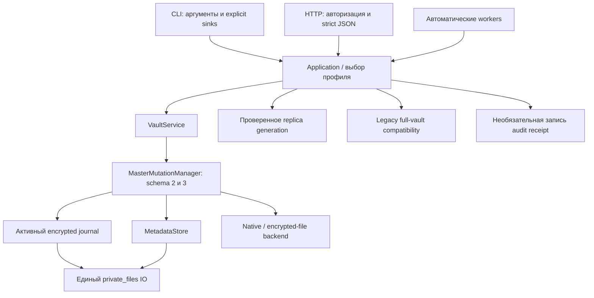

# Keys Keeper: исправления и сокращение архитектурного скоупа

> Этот отчёт фиксирует этап hardening до удаления S3. Следующий этап и текущие
> границы VPS описаны в [VPS refactor](VPS-REFACTOR-2026-10-02.md).
> Проверки ниже относятся к указанным коммитам, а не автоматически к новой версии.

Дата: 2 октября 2026 года. Исходная версия: `0.11.1`, коммит
`36df576ba403437d6352add265232bc01601cbae`. Изменения подготовлены в ветке
`codex/simplify-and-harden`; они не являются установленным или выпущенным релизом.

## Принятые границы

Реализован один путь обычной записи master vault для schema 2 и schema 3:
`VaultService → MasterMutationManager → OperationJournal + MetadataStore + backend`.
Автоматической миграции schema 2 в schema 3 нет. Проектный импорт сохраняет
свою существующую координацию и постоянный dedup ledger; replica остаётся
отдельным проверяемым контуром.

Убраны отдельные legacy CRUD/bulk/snapshot алгоритмы из `service.py`, дубли
приватного файлового IO и копии предиката обязательного секрета. HTTP и S3 worker
больше не используют CLI как application layer. Новый framework, dependency,
сетевой протокол или формат metadata не добавлялся.

`service.py` сокращён с 411 до 177 физических строк, `cli_sync.py` — с 486 до
221, `secure_io.py` — со 175 до 75. Application-функции синхронизации перенесены
в `sync_application.py`; общий IO и Windows DACL добавляют необходимые проверки.
Главное сокращение — один алгоритм обычной mutation и меньше допустимых
неоднозначных режимов ввода.

Скоуп функций намеренно ограничен:

- `inject` принимает однозначное однострочное literal dotenv значение.
  Неоднозначное экранирование, интерполяция и duplicate assignments отклоняются.
- Bulk import в локальном интерфейсе поддерживает API keys и защищённые notes.
  Структурные записи создаются отдельной формой или CLI; поля не угадываются.
- Имя referenced entry нельзя изменить до удаления входящих ссылок.
  Reference-ID migration и автоматического переписывания графа нет.
- Backup output не заменяет существующий файл молча. Legacy export имеет
  явный `--replace`; project recovery bundle требует нового пути.
- Завершённые операции — ограниченная диагностика: до 64 encrypted receipts
  в контейнере до 1 MiB. Это не вечный журнал истории и не dedup authority.

## Закрытие исходных замечаний

| Пункт исходного ревью | Исправление и проверяемое поведение |
|---|---|
| F01, неполные snapshots | Общая полная snapshot preparation. Required primary secrets обязаны существовать; любое failed read присутствующего account прекращает export/sync до публикации. Optional absent passphrase допустима. |
| F02, перепривязка после rename | Service и direct store update отвергают rename при входящих refs. Метаданные, секрет и revision остаются прежними в schema 2/3. |
| F03, Windows private files | Protected DACL и TokenUser owner задаются при создании, до payload. Для существующего объекта также допустим exact текущий TokenOwner, если он уже входит в доверенные SYSTEM/Administrators. OWNER RIGHTS ACE допускается только после проверки владельца; он не является допустимым owner SID. Opened handle проверяется на type/reparse/owner/ACL. Внешние каталоги не перенастраиваются. |
| F04, бесконечная secret history | Completed before/after images удаляются после durable receipt; pending state сохраняется. Bounded legacy compaction и cleanup только известных crash-temp имён. Все ciphertext reads продолжают GCM authentication, cache не заменяет проверку. |
| F05, schema 2 crash window | Обычные CRUD, batch и snapshot replacement проходят общий durable manager. Secret/metadata crash points восстанавливаются без миграции схемы. |
| F06, backup IO | Bounded binary no-follow reads, atomic private publication, explicit overwrite policy, read-back legacy export и committed uncertainty receipt. Project backup сохраняет необходимый journal authority key и в schema 2. |
| F07, dotenv injection | ENV-name, duplicate assignment и literal serializer проверяются до credential write. Неоднозначные значения не преобразуются молча. |
| F08, resolve после denial | Metadata preflight, один read на unique key, stop на первом failed read, failed audit outcome. Один replica backend instance использует одно authenticated generation на операцию. |
| F09, HTTP contracts | Один bounded parser: object/type/allowed keys, duplicate members, depth/node limits. Auth выполняется до domain work; safe outer error boundary удерживает соединение и не выводит provider exception text. |
| F10, notes | Public body хранится в fields; sensitive body — только в credential storage. Exact boolean `secret_body`; sensitive fields.body запрещён. Реальная JS-форма проверяется против изолированного HTTP API. |
| F11, ложный audit failure | Audit failure не отменяет committed action. JSON/CLI receipts сообщают committed/audit status. Activity newest first; history привязана к stable entry ID и batch affected IDs. |
| F12, filesystem races | Nonblocking FIFO rejection, bounded inputs, descriptor validation, bytes/timestamps/inode conflict checks, create-only publication для ранее отсутствовавшего target. |
| F13, empty metadata | Существующий пустой или whitespace-only файл — ошибка восстановления. Он не становится новым пустым vault и не перезаписывается. |

Дополнительно независимое ревью нового общего manager проверило неправильный
`Entry`/`SecretInput`, отсутствие обязательного секрета и race после metadata
commit. Входные данные валидируются до pending marker. Expected after revision
сохраняется под metadata lock; перед закрытием journal снова проверяются after
images и revision. Дивергенция не выдаётся за успешный commit.

## Восстановление и эксплуатационные пределы

Обычная следующая mutation сначала завершает известное pending восстановление.
`keys doctor` показывает состояние без чтения entry values; `keys doctor
--recover` явно запускает тот же manager для master profile. Дивергировавшая
metadata, потерянный journal key или повреждённый ciphertext останавливают
автоматическое восстановление. Не повторяйте такую mutation вслепую.

Resource limits применяются до дорогой recovery работы: migration preflight —
10 064 файлов и 672 MiB; активные pending records — 10 000 / 512 MiB. Завершённая
история не расходует активный лимит после compaction. Существующие backup,
копии на диске и физические блоки носителя этим механизмом не стираются.

Private-file conflict checks остаются optimistic: процесс, не использующий
общий lock, может вмешаться после последней проверки перед rename. Windows
DACL не изолирует от SYSTEM или администратора. CLI sink discipline уменьшает
попадание plaintext в транскрипт, но не изолирует от кода под тем же OS user.

S3 setup остаётся ручным bootstrap compatibility-функции: обычные ошибки
компенсируются, config publication uncertainty сохраняет парные новые
credentials/config, но hard kill между несколькими reserved-account writes
может потребовать повторного setup. Новый journal для всех transport settings
не добавлялся. Broker mode, новые sync transports и дополнительные UI features
не входят в эту работу.

## Проверка

Focused suites проверяют fake backend, изолированный encrypted-file vault,
реальный loopback HTTP, JS serializer, process termination, receipt corruption,
resource ceilings и file conflicts. Windows native DACL tests входят в OS CI
matrix; локальный macOS прогон не доказывает их исполнение на Windows.

Полный локальный прогон: **1852 passed, 25 skipped, 4 subtests passed**, ошибок
нет; 1877 collected cases, около 681 с, code commit `26c1cd0`. Среда: macOS,
Python 3.12.11, pytest 9.1.1,
cryptography 48.0.1. Пропуски включают Windows-specific checks, четыре live
Secret Service case и два native clipboard case с выключенным opt-in.

Первый Windows CI обнаружил несовместимость owner check с обычным TokenOwner
elevated process. Исправление принимает только доверенный exact process default;
new private creation сохраняет строгий TokenUser owner. Native assertion
сравнивает числовой SID, поскольку SDDL может использовать стандартный alias.
Отдельный тест `.env` теперь читает UTF-8 явно. После исправления: 47 passed /
8 platform skips по IO/owner checks и 62 passed / 1 native clipboard skip по
CLI/fixtures. Окончательное исполнение native cases проверяется по новому SHA
платформенного CI.

Следующий Windows прогон подтвердил все шесть исходных native ACL cases без
пропусков. Из оставшихся 47 failures 46 сняла подготовка private fixtures:
обычный pytest tmp root наследовал публичные Windows grants. Windows-only
fixture задаёт protected DACL пустому синтетическому каталогу до payload.
Unsafe native cases явно добавляют foreign grants и проверяют отказ без repair.
Focused проверка этой правки: 73 passed / 8 platform skips, включая clipboard
isolation и Keychain mode.

Последний failure выявил отдельную совместимость со стандартным
`os.mkdir(mode=0o700)` CPython: его Windows DACL использует OWNER RIGHTS.
Этот ACE обозначает текущего владельца объекта, а не отдельного пользователя.
Теперь exact SID `S-1-3-4` допускается в ACE только после успешной проверки
владельца. Owner/TokenOwner whitelist не расширен; foreign owner и Everyone
по-прежнему отвергаются. Причина проверена по
[CPython 3.12.10](https://github.com/python/cpython/blob/v3.12.10/Modules/posixmodule.c),
[описанию os.mkdir](https://docs.python.org/3.12/library/os.html#os.mkdir) и
[семантике OWNER RIGHTS Microsoft](https://learn.microsoft.com/en-us/windows-server/identity/ad-ds/manage/understand-special-identities-groups#owner-rights).

Добавлен седьмой native case: стандартный private каталог и inherited file
принимаются без изменения ACL; foreign owner отвергается до обхода ACE;
OWNER RIGHTS вместе с Everyone остаётся ошибкой. Старые Python проверяют
эквивалентный OWNER RIGHTS descriptor на пустом синтетическом каталоге.
Итоговый локальный focused прогон: 100 passed / 9 platform skips. Windows
preflight исполняет native/private IO cases до длинного полного прогона.
Финальная полная матрица проверяется по PR head.

Wheel построен и установлен в чистое временное окружение. Проверены импорт из
установленного пакета, CLI surface, генерация skill и совпадение payload в
обеих упаковках. Canonical prose, UI tokens, compileall и diff whitespace
checks проходят. Отдельный updater прогон: 28 passed.

Project idle benchmark: 6 scopes × 3 cycles, 0 journal writes, 0 изменённых
encrypted files, 6 cold KDF derivations. Результат характеризует синтетический
idle workload; физическое энергопотребление не измерялось.

Локальные результаты, версии, SHA исходного кода и checksum нового wheel
сохранены в [verification.json](hardening-evidence-2026-10-02/verification.json).
Receipt сохраняет fingerprint 285 файлов полного локального прогона отдельно
от 286 файлов после Windows correction; SHA для каждой проверки указан явно.
Платформенное исполнение, native Windows DACL, Linux Secret Service, macOS build
и combined coverage подтверждаются отдельными
[GitHub Checks draft PR №21](https://github.com/kyzdes/keys-keeper-skill/pull/21/checks).
Checks привязаны к SHA PR head; изменение только этого отчёта не меняет
validation-tree fingerprint. Окончательные результаты CI также фиксируются
в [описании PR](https://github.com/kyzdes/keys-keeper-skill/pull/21).

При ранних локальных прогонах старые clipboard integration tests записали
синтетические значения в системный clipboard. Ordinary pytest теперь всегда
использует fake clipboard, timer и clear helper. Native clipboard tests
требуют отдельного `KEYS_KEEPER_TEST_NATIVE_CLIPBOARD=1`; CI может выполнить их
на одноразовом runner. Пользовательский vault и login keychain не использовались.

Историческое исходное ревью: [ARCHITECTURE-REVIEW-2026-10-02.md](ARCHITECTURE-REVIEW-2026-10-02.md).
Публичные CLI contracts: [CLI-SINK-CONTRACT.md](../CLI-SINK-CONTRACT.md).
