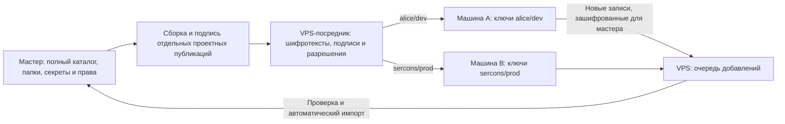

# Папки, проекты и ограниченная выдача секретов на машины

Дата: 2026-09-05. Статус: **proposed** — архитектура проверена сабагентами,
отдельные компоненты представлены локальным незавершённым прототипом.
Исходный анализ: ветка `codex/vps-sync-kk2`, HEAD `c3ab31f`; прототип —
`codex/project-scoped-vaults` поверх `223a677`, без выпуска.
Этот документ не утверждает готовность сквозной проектной изоляции или её deployment.
Рабочие хранилища, значения секретов и production в рамках проектирования не проверялись и не изменялись.

Порядок инженерной работы, зависимости PR, миграция и матрица приёмки вынесены
в [план реализации](PROJECT-SCOPED-VAULTS-IMPLEMENTATION-PLAN.md).

## 1. Решение

На мастер-компьютере остаётся полный каталог и управление доступом. Папки
организуют каталог. Для выдачи на машины мастер формирует отдельные проектные
хранилища с независимыми ключами шифрования. VPS-посредник хранит зашифрованные
публикации и передаёт их разрешённым устройствам.

Единица выдачи — **проект + окружение**, далее `scope`. Например, `alice/dev`
и `alice/prod` — разные криптографические хранилища. Если разделение окружений
не нужно, проект использует один `default`. Доступ к `default` не означает доступ
к будущим окружениям.

Подтверждённые пользователем требования:

- Мастер управляет существующими ключами и правами доступа.
- Удалённая машина получает ключи проекта и может создавать в нём новые. Менять
  существующие ключи она не должна. Новые ключи передаются через VPS на мастер.
- Один исходный секрет можно явно включить в несколько scopes.

Предлагаемые уточнения реализации:

- Нормальные новые записи принимаются мастером автоматически после проверки.
  Конфликты и нарушения политики попадают в отдельный список для разбора.
- Машина получает текущую утверждённую версию и последующие публикации своих scopes.
- Папка, тег, имя проекта, hostname и файл в репозитории не являются основанием для выдачи.
- Частным записям выдача запрещена по умолчанию. Присвоить папку можно без публикации.



Если посредник и рабочее окружение находятся на одном VPS, компрометация этого
хоста раскрывает все scopes, которые он получил как рабочая машина. Разные
контейнеры и каталоги не защищают их от владельца root-доступа к хосту.

## 2. Исходный код и необходимые изменения

Таблица описывает исходную точку `c3ab31f`. Часть изменений уже есть в прототипе;
актуальная инвентаризация и оставшиеся условия приёмки — в разделе 16 плана.

| Проверено в коде | Следствие для реализации |
|---|---|
| `models.py:Entry` содержит tags/refs, но не проекты и папки | Нужны отдельные сущности и миграция каталога |
| `sync.py:build_snapshot_payload` читает весь `store.list()`, секреты и tombstones | Нельзя использовать его для ограниченной выдачи с фильтрацией после чтения или скачивания |
| `sync_vps.py:VpsSyncConfig` хранит один `vault_id`; состояние находится в общих sidecar-файлах | Нужны явные локальные профили и состояние на каждый scope |
| `cli_sync_vps.py:cmd_vps_approve` передаёт новому устройству общий VaultKey | Нужна передача только ключей разрешённых scopes |
| В KK2 обычные коммиты может публиковать любое активное устройство | Нужны подписанные права read/create и отдельный канал добавлений; полный снимок подписывает только мастер |
| `sync_vps.py:_apply_payload` объединяет локальное и удалённое хранилища | Для читателя нужна установка авторитетного полного снимка своего scope |
| `backend_file.py` использует один `secrets.enc` на `KEYS_KEEPER_HOME`; параметр service не меняет путь | Для профилей нужно явно прокидывать Paths и разделять файлы, учётные записи backend и sync-ключи |
| `models.py:validate_snapshot_payload` принимает schemas 1/2 и отклоняет неизвестные поля | Требуется новая версия схемы; старые клиенты не должны терять поля при перезаписи |
| KK2 отзывает серверный доступ, но не меняет VaultKey | Ротация ключей шифрования обязательна до заявления о криптографическом отзыве |

Основа для повторного использования: транспорт HTTPS, каноническая сериализация,
подписи, проверка цепочек, приглашения с проверкой отпечатков, CAS, безопасные
ошибки и инфраструктура тестов. Проектная выдача меняет модель доверия, поэтому
не должна включаться как скрытый режим существующего full-vault sync.

## 3. Модель каталога и доступа

| Сущность | Предлагаемые поля и смысл |
|---|---|
| `Folder` | Стабильный UUID, `parent_id`, название, порядок. Только навигация |
| `Entry` | Существующий UUID, `folder_id`, `distribution=local_only/project_allowed`, остальные существующие поля |
| `Project` | UUID, slug, название, состояние. Видимый раздел интерфейса |
| `Scope` | UUID, `project_id`, окружение, отдельный `vault_id`, epoch, версия политики |
| `ProjectEntry` | Явная связь `scope_id -> entry_id`, локальное имя, экспортируемые метаданные, версия утверждения |
| `Device` | UUID, публичные ключи подписи и шифрования, метка устройства, состояние |
| `Grant` | Подписанные `scope_id`, `device_id`, публичные ключи получателя, роль, версия политики, epoch и checkpoint |
| `Publication` | Полный снимок scope, монотонный sequence, epoch, parent, версия политики, хеш шифротекста, подпись мастера |
| `CreateSubmission` | Неизменяемое зашифрованное добавление: scope, device, grant version, request ID, подпись, payload |
| `ImportReceipt` | Подписанный мастером результат приёма: request ID, статус, canonical entry ID, ревизия; без значения секрета |

Все изменяемые имена служат для UI; разрешения и ссылки опираются на UUID.
Удаление и повторное создание проекта с тем же именем не восстанавливает доступ.
Проверяются циклы папок, отсутствующие родители, глубина и ссылки на несуществующие
сущности. Удаление непустой папки требует выбора новой папки; это не удаление ключей.

Запись имеет одну основную папку; в проектах отображаются ссылки на неё. Так один
ключ можно увидеть в нескольких проектах без нескольких независимо редактируемых
оригиналов на мастере. Изменение общего ключа ставит в очередь публикации всех
scopes, куда он включён. Статус каждой публикации показывается отдельно: общей
атомарной доставки на все машины нет.

Модель явно разделяет действия:

- «Переместить в папку» меняет организацию каталога.
- «Добавить в проект / окружение» меняет набор выдаваемых данных и показывает получателей.
- «Разрешить машине доступ» выдаёт текущие и будущие утверждённые публикации scope.
- «Исключить из проекта» прекращает будущую выдачу этой записи; не возвращает прежние копии.

Перетаскивание на раздел проекта может открыть один экран добавления с просмотром
изменений. Пакетное добавление содержимого папки фиксирует конкретные UUID на момент
подтверждения. Оно не создаёт правило «все нынешние и будущие записи этой папки».
Простое переименование/перемещение папки никогда не меняет список получателей.

Матрица прав первой версии:

| Действие | Мастер | Удалённый contributor | Необязательный reader |
|---|---:|---:|---:|
| Получать и использовать ключи своего scope | Да | Да | Да |
| Создать новую запись в своём scope | Да | Да, через очередь добавлений | Нет |
| Изменять/удалять уже созданную запись | Да | Нет, включая собственные ранее отправленные записи | Нет |
| Добавлять существующий ключ в другой проект | Да | Нет | Нет |
| Менять grants, получателей, папки мастера и политику | Да | Нет | Нет |
| Подписывать авторитетный снимок scope | Да | Нет | Нет |

Право `create` включает заранее делегированное добавление новых записей в этот
scope. При выдаче такого права UI сообщает, что после приёма мастером новые записи
будут доступны всем получателям scope. Это не право изменять его политику или
выбирать другие проекты. По запросу отдельную машину можно подключить с `read`.

Для первой версии scope выдаётся целиком. Если двум машинам нужны разные наборы
одного проекта, следует создать два явно названных scopes. Фильтр на клиенте
не создаёт более узкого доступа внутри общего ключа шифрования.

## 4. Сборка проектной публикации

Мастер сначала рассчитывает разрешённый набор UUID и проверяет его метаданные.
Только после этого он обращается к backend за значениями включённых записей.
В payload не попадают полный каталог, глобальные tombstones, audit, конфигурация
мастера, другие проекты, recovery, sync admin token и служебные приватные ключи.
Зарезервированные учётные записи исключаются безусловно; особо чувствительные
обычные записи дополнительно защищаются `local_only`.

Публикация содержит проекцию данных: только необходимые поля, локальные названия,
нужные ссылки и выбранные пользователем заметки. Личные заметки, другие теги,
произвольные fields и полное дерево папок автоматически не копируются. Поля,
необходимые для валидации типа записи, включаются явно. Нужные публичные метаданные
например host/user/port для server проверяются на мастере до чтения секретов.

Ссылки `refs`, особенно `server -> ssh_key`, требуют отдельной проверки. Сборщик
не подтягивает связанный секрет автоматически. Обязательная зависимость вне scope
блокирует публикацию и указывается в preview; необязательная ссылка удаляется из
проекции. Все экспортируемые ссылки разрешаются только внутри этого scope.
Нельзя разрешать их через глобальный поиск или загрузку другого проекта.
До миграции refs на ID существующие ссылки по имени преобразуются по явно
проверенной таблице соответствия; неоднозначность — ошибка.

Если нужный секрет недоступен из backend, сборка завершается ошибкой. Нельзя
превращать такую ошибку в `null`, публиковать частичный снимок или продолжать
под видом успешного удаления секрета.

Preview показывает состав, окружение, устройства, изменения относительно текущей
публикации и зависимости, без значений секретов. Он привязан к ревизии каталога,
набора и политики. При изменении состава между preview и записью повторно
рассчитывается план; секреты не должны попадать новым получателям по устаревшему
подтверждению. Изменения значений уже включённых записей публикуются автоматически
с согласованной ревизией и ограниченными повторами.

## 5. Ключи и протокол

Каждый scope имеет независимый случайный 256-битный ключ `K(scope, epoch)`.
Устройство не получает общий VaultKey мастера, корневой ключ подписи, recovery
или seed, из которого можно вывести ключи других scopes. На посреднике нет
ключей расшифровки и значений секретов.

Снимки шифруются AEAD и подписываются мастером. Контекст подписи и AEAD связывает
версию протокола, vault/scope ID, epoch, sequence и версию политики. Manifest
также связывает parent и хеш ciphertext. Названия проектов и содержимое каталога
остаются внутри шифрования; посредник видит случайные ID, размеры, время и граф
выдачи. Не обещается скрытие этих технических метаданных.

Ключ scope шифруется отдельно на публичный ключ каждого разрешённого устройства.
Контекст обёртки связывает получателя, его публичный ключ, scope, epoch и хеш
подписанного разрешения. Перед расшифровкой проверяются подпись мастера, привязки,
права и checkpoint. Получатель не может расширить grant изменением локального JSON.

Рабочее имя нового профиля: `KK3-projects-v1`; окончательное wire-описание
и независимые тестовые векторы фиксируются первым инженерным этапом. Формат
прототипа ещё не является стабильным контрактом релиза. HTTP API `/v2/`
версионируется отдельно от `/v1`, который использует KK2.
Неизвестный профиль или schema приводят к отказу, без downgrade к full-vault sync.

Новые обёртки желательно реализовать стандартной поддерживаемой реализацией HPKE,
если совместимая библиотека проходит проверку поддержки платформ и тестовых
векторов. Текущая X25519/HKDF/AES-GCM конструкция KK2 не должна называться HPKE
без соответствия RFC. Выбор реализации — обязательный результат этапа 0,
до фиксации релизного wire-контракта; смена библиотеки сама по себе не решает отзыв или replay.
Нужны независимые протокольные тесты и проверка криптографического дизайна.
В прототипе используется собственная композиция X25519/HKDF/AES-GCM;
это не закрывает окончательный выбор конструкции и независимый review.

Получатели принимают публикации только от разрешённого издателя. Наличие у
contributor своего ключа подписи позволяет подписать запрос создания, но не
авторитетный снимок, исправление существующей записи или grant.
Сервер проверяет разрешение для каждого запроса — HEAD, snapshots, history, wraps,
devices, invites, inbox и mutations. Запрос к чужому scope не раскрывает его содержимое
или список устройств. Клиент отдельно проверяет авторство, даже если relay
сфальсифицировал свою таблицу ролей.

## 6. Подключение, получение и отзыв

### Подключение

1. На чистой машине создаётся собственная идентичность и запрос регистрации.
2. На мастере пользователь выбирает scopes, сверяет отпечаток и видит состав выдачи.
3. Для каждого затронутого scope мастер создаёт новый epoch и текущий полный снимок.
   Новому устройству передаётся только новый ключ. Это исключает расшифровку
   исторических снимков с уже удалёнными записями через ключ старого epoch.
4. Мастер подписывает grants и checkpoint, шифрует новый ключ для всех оставшихся
   и новых получателей. Relay атомарно принимает политику, обёртки и новый HEAD.
5. Машина завершает приглашение, проверяет доверенную подпись и получает scopes.

Для подтверждения актуальности нового подключения устройство создаёт одноразовый
challenge. Мастер подписывает ответ с этим challenge, устройством, grant, policy,
epoch и точным итоговым HEAD после выдачи доступа. Старый подписанный invite
не заменяет такой ответ. Доверенный checkpoint хранится отдельно от checkpoint
уже установленного поколения: до первого успешного pull последнее поле пусто.

Приглашение одноразовое и ограниченное по времени; один потерянный HTTP-ответ
не создаёт вторую идентичность. Bootstrap не требует загрузки мастер-хранилища
или передачи admin token на рабочий VPS.

### Обычная работа

На мастере изменение создаёт задание в устойчивой очереди с UUID и ревизиями,
без значений секретов. Повторы ограничены; ошибки видны в UI. Фоновые операции
не открывают Keychain UI и честно сообщают, когда публикация ожидает разблокировки.

Relay хранит последнюю утверждённую публикацию: выключенный мастер не мешает
получать уже опубликованные данные или отправлять новые записи в очередь.
Приём новых записей в общий каталог, публикация, выдача и смена прав требуют
доступного мастера. Клиенты показывают `published revision`, `applied revision`,
время последней проверки и pending/error. Подписанная квитанция устройства
подтверждает его заявление о применении; скомпрометированный клиент может солгать.

Получатель устанавливает полный снимок в отдельный профиль scope. Записи,
которых нет в новой полной публикации, удаляются из управляемой реплики без
создания глобальных tombstones. Локальные самостоятельные записи находятся
в другом профиле, а ещё не принятые добавления — в отдельном outbox. Обычный
двусторонний merge KK2 здесь не применяется.

### Новые ключи с удалённой машины — часть первой версии

Это отдельный поток `create`, который никогда не используется как `upsert`.

1. Пользователь или агент создаёт ключ в текущем разрешённом scope. На машине
   формируются новый request UUID, временный локальный entry ID и неизменяемый
   payload. Значение остаётся в защищённом backend/outbox и сразу может применяться
   на этой машине, если его имя не перекрывает существующую запись.
2. Payload шифруется для отдельного публичного inbox-ключа мастера этого scope;
   его подлинность подтверждена подписью мастера в политике. Приватный inbox-ключ
   есть только на мастере и в offline recovery. Contributor подписывает конверт,
   связывая scope, device, request ID, grant version и хеш ciphertext. Если используется
   гибридная схема, для сообщения создаётся независимый случайный ключ данных.
3. Relay проверяет активное право `create`, привязки и подпись; записывает
   immutable envelope. Он не может читать новые секреты. Другие машины проекта
   пока не получают их. Тот же request ID с тем же ciphertext — безопасный повтор;
   тот же ID с другим содержимым — конфликт. Временная ошибка сохраняет outbox.
4. При синхронизации мастер независимо проверяет grant, подпись, scope, лимиты,
   schema, имена и refs; затем расшифровывает payload и проверяет содержимое.
   Он выделяет новый canonical UUID и записывает отображение
   `(scope, device, request_id) -> canonical_entry_id` в устойчивый журнал.
5. Новая запись автоматически появляется на мастере с `origin_device` и связью
   только с исходным scope. Она ставится в очередь обычной публикации для этого
   проекта. Мастер не разрешает отправителю назначать запись другим проектам,
   передавать произвольный backend account или помечать её как доверенную.
6. После устойчивой записи metadata, секрета и dedup mapping мастер выпускает
   подписанную квитанцию `accepted`, а после публикации — её revision. Получатель
   заменяет pending-запись канонической без дубля. Публикация мастера доставляет
   новый ключ остальным разрешённым машинам проекта.

Inbox-ключ независим от ключей шифрования публикаций: обычный новый epoch не
делает ожидающие добавления нечитаемыми. При импорте проверяется текущая цепочка
прав: старое сообщение допустимо при сохранённом праве create того же устройства
и scope, а удаление/повторная выдача grant не оживляют предыдущие запросы. Ротация
самого inbox-ключа требует учёта очереди и версий обёрток в recovery.

Таким образом, выключенный мастер задерживает появление ключа на мастере и
других машинах, но не его локальное создание, использование и сохранение на VPS.
Статусы: `local pending`, `uploaded`, `accepted by master`, `published`, `conflict`.
Отправленный новый ключ считается неизменяемым: его дальнейшую редакцию или
удаление выполняет мастер, в том числе когда автором была эта же машина.

Защита права «создать, но не изменить»:

- На relay нет contributor-endpoint для замены snapshot, entry, имени или refs
  существующей записи. Разрешены только append и чтение своих квитанций.
- Master importer не использует переданный ID как адрес существующего секрета.
  Коллизии имён, alias и зарезервированных namespace не разрешаются перезаписью,
  автоматическим rename/shadow или схемой «последняя запись победила».
- Существующая запись не превращается в новую через `replaces`, patch, tombstone,
  тип операции или поддельную дату. Такие поля отклоняются по строгой schema.
- Нормальный create не требует ручного подтверждения каждого ключа. Конфликт
  отправляется в карантин с объяснением без secret value; оригинал не меняется.
- Имена проверяются на нормализацию и регистр. Refs разрешены только в исходном
  scope; payload не расширяет граф доступа. Папки мастера не задаются отправителем.
  Если новый авторитетный снимок конфликтует с именем локального pending-ключа,
  pending-ключ уходит в конфликт и не перекрывает запись мастера при resolve/inject.
- Метаданные созданной записи остаются недоверенным вводом. Импорт не запускает
  команды, сетевые проверки, SSH-подключения, provider API или инструкции из notes.
  `accepted` означает корректность импорта, а не проверку работоспособности ключа.
- Ограничиваются размер/количество сообщений и записей на device/scope, частота,
  глубина JSON и refs. Нарушитель с `create` может отправлять мусор только в свой
  scope; он не должен исчерпать неограниченно диск или заблокировать весь каталог.
- После отзыва устройства ещё не принятые сообщения от него автоматически
  не импортируются, даже если в них стоит старая дата. Они сохраняются в карантине.
  Уже принятые записи с его provenance доступны мастеру для проверки и отзыва.

Получатель может менять собственные файлы при компрометации ОС, поэтому запрет
редактирования гарантирует целостность авторитетного каталога и других реплик,
а не неизменность локальной памяти атакующего. Скомпрометированный contributor
также способен добавлять ложные новые credentials своего проекта. Если нужно
исключить и это последствие делегирования, требуется режим ручного приёма;
он не включается по умолчанию вместо запрошенной автоматической синхронизации.

### Отзыв и уменьшение доступа

Сначала мастер устойчиво сохраняет локальный запрет grant. Затем отправляет
relay block и подготавливает новую политику, независимый новый ключ epoch,
обёртки оставшимся получателям и полный снимок. CAS-транзакция фиксирует этот
комплект вместе. Отсутствие revocation в ответе relay не отменяет локальный запрет.
Новые секреты не публикуются с отзываемым получателем, а его ещё не принятые
create не импортируются, в том числе после рестарта. HTTP-успех block не доказывает,
что недоверенный сервер прекратил доступ к старым данным.

При сбое UI показывает «Отзыв начат; смена ключа не завершена». Уже подготовленные
старые публикации требуют согласования: если запрос мог быть принят до потери
ответа, считать его данные потенциально раскрытыми. Автоматически повторять такую
выдачу после локального отзыва нельзя. Детали recovery и приёмка — D01 плана.

Epoch меняется при добавлении или удалении получателя, восстановлении доступа
и изменении состава выдаваемых записей. При исключении записи новая история
не шифруется старым ключом; старые копии при этом остаются доступными тем, кто
их уже получил. Локальная очистка управляемого профиля является обслуживанием,
а не доказательством стирания данных у злоумышленника.

Если устройство было скомпрометировано, требуется ротация самих API-токенов,
паролей и SSH-доступов у сервисов. Для общих секретов затронуты все связанные
проекты. Одно и то же значение, скопированное в другой scope, не становится
другим credential: отдельные project/service accounts предпочтительны.
Эффективный доступ к общей записи — объединение получателей всех её scopes.
Отзыв из одного scope не скрывает оставшийся путь доступа через другой;
права API/SSH credential у провайдера также не сужаются фильтрацией Keys Keeper.

Локально закрепляются максимальные policy version, epoch и sequence. Старые,
несвязанные и повторно подставленные состояния отклоняются. Новая установка
получает свежий checkpoint через challenge-response с мастером. Relay может скрывать обновления, выключиться
или поддерживать разные допустимые представления для клиентов; полная защита
от такого поведения требует независимого канала сверки. Offline-клиент не может
доказать актуальность прав. Истечение grant не уничтожает скачанные значения.
При недоступном мастере уже подключённый клиент использует проверенную копию
с видимым временем последней проверки; новое подключение и обновление доверенного
ориентира ждут мастера. Подлинная цепочка сама по себе не доказывает свежесть HEAD.

## 7. Хранение на мастере и VPS

На мастере пользователь видит единый каталог, но операции получают явный контекст
профиля. Предлагается разделить registry, master metadata и `profiles/<scope-id>/`
с данными, аудитом, состоянием и locks. Sync credentials и backend accounts
имеют namespace профиля. Одного изменения `KEYS_KEEPER_HOME` недостаточно для
разделения записей в общесистемном Keychain.

У headless-получателя каждый профиль содержит только свои секреты и свой ключ
разблокировки. File backend должен принимать явный Paths, а безопасный источник
разблокировки поддерживать защищённый файл/дескриптор или системное хранилище,
без передачи значений в argv, историю shell и журнал сервиса. Текущая env-схема
не должна использовать пароль/ключ мастер-компьютера на удалённой машине.

Шифрование на диске защищает некоторые сценарии утраты файлов, но работающий
процесс должен уметь открыть свои секреты. Root-компрометация VPS раскрывает
все выданные этому хосту scopes. Изоляция между приложениями одного хоста требует
отдельных ОС-учётных записей/изоляции; она не заменяет разделение хостов при root.

Полный master-каталог и полномочия восстановления не распространяются через
проектные профили. Для MVP — отдельная зашифрованная offline-копия мастера с
проверенным восстановлением. Backup включает каталог, значения, проектные
ключи/политики, inbox-ключи и dedup mapping, средства восстановления управляющей
идентичности. До выдачи `create` inbox-ключ должен войти в проверяемую резервную
копию; иначе потеря мастера сделает ожидающие сообщения нечитаемыми. Потеря
мастера требует восстановления доверенной идентичности либо явного нового
подключения клиентов с проверкой нового корня. Relay не может назначить новый
доверенный корень самостоятельно. Одного текущего KK2 recovery wrap недостаточно
для восстановления управления: он не восстанавливает право подписи.

Backup должен фиксировать согласованную ревизию каталога/секретов, journals,
dedup, spent grants и checkpoints. Восстановленный профиль сначала не выполняет
publish/import. Продолжить старую управляющую identity можно после подтверждения
актуальности и прекращения работы прежнего издателя. Иначе путь MVP — новая
identity и явное переподключение получателей с новым pin. Недоверенный relay
и его CAS не предотвращают раздвоение истории у двух мастеров с одним private key.
Процедура и проверка stale backup определены в D06 плана.

## 8. UI и CLI

Слева: «Все записи», «Личные», папки, «Проекты», «Устройства». В проекте —
окружения, состав выдачи, получатели и состояние доставки. В карточке секрета —
основная папка, список scopes и устройств, которым он доступен. У удалённой
машины виден только её каталог; скрытые записи не попадают в поиск и API.

Добавление в проект показывает эффект одной операцией: «Будет доступно машинам
A и B». Переименование папки дополнительных шагов не требует. Режим общего
ключа показывает все места использования и последствия ротации.

Иллюстрация будущего CLI; **эти команды ещё не реализованы**:

```bash
keys folders create "Работа/Боты"
keys projects create alice
keys projects add alice --env dev --entry alice-api
keys projects preview alice --env dev
keys devices grant vps-alice --project alice --env dev --role contributor
keys projects publish alice --env dev
keys sync pull --project alice --env dev
keys add alice-new-api --type api_key --project alice --env dev --stdin
keys sync submit --project alice --env dev
keys sync receive --project alice --env dev
keys info alice-api --project alice --env dev
keys devices revoke vps-alice --project alice --env dev
```

`add`/`submit` выше выполняются на удалённой машине, `receive` — на мастере;
обычная синхронизация также обрабатывает эти очереди. Значение передаётся через
stdin/защищённый источник, а не буквальным аргументом команды.

Имя устройства в CLI разрешается в проверенный UUID/отпечаток. Конфигурация проекта
может задавать удобный scope по умолчанию, но никогда не даёт доступ. При отсутствии
scope или неоднозначном имени операция завершается ошибкой; fallback к мастеру
или поиску секрета в других проектах запрещён. `inject`, `resolve`, `ssh`, API,
экспорт и agent rules используют одинаковый контекст доступа.

## 9. Миграция и совместимость

1. Перед изменением данных проверить резервную копию и инвентаризировать версии
   клиентов, legacy sync, устройства и локальные профили — без значений секретов.
2. Все существующие записи сохраняют UUID и значения. Добавляются папка
   «Неразобранное», `distribution=local_only` и пустые связи с проектами.
3. Новая schema каталога читается только совместимым клиентом. Старым CLI,
   importer/exporter, Admin и WebVault запрещено перезаписывать новые данные.
4. Пользователь собирает первый scope через preview. Никакой автоматической
   классификации по тегам, имени или заметкам с последующей выдачей.
5. Получатель начинает с чистого ограниченного профиля. Ему никогда не передаётся
   текущий общий VaultKey. Старый full-vault профиль не превращается в «безопасный»
   простым скрытием лишних записей.
6. Legacy KK2 и новый протокол используют разные идентификаторы/профили; новые
   scopes не экспортируются назад в общую legacy-цепочку. Full-vault sync остаётся
   явно обозначенным режимом только для полностью доверенных компьютеров, если нужен.
7. Если машина раньше уже получила весь vault, уменьшение доступа не отменяет
   прежнего раскрытия: нужны инвентаризация копий, чистое подключение и по ситуации
   ротация всех ранее доступных credentials. Автоматическое удаление backup не
   используется как доказательство безопасности.

Откат до пользовательской миграции — отключить новую функцию. После миграции
нельзя запускать старый writer на новой schema. Восстановление выполняется
из сохранённой совместимой копии; откат приложения не включает обратно отозванные
grants и legacy-раздачу.

## 10. План реализации и условия готовности

| Этап | Изменения | Проверяемый результат |
|---|---|---|
| 0. Контракт | Threat model, модель ролей, wire/schema, epochs, recovery, выбор реализации key wrap | Зафиксированы тестовые векторы и отрицательные сценарии; нет обещания remote erasure |
| 1. Каталог | `models.py`, `store.py`, `service.py`, folders/projects/ProjectEntry, API и Admin | Папки работают; миграция сохраняет записи; folder move не меняет grants; новая запись остаётся local_only |
| 2. Проектная публикация | Новый `project_service`/`project_projection`, явные Paths и namespace backend, preview | Сборщик даже не читает запрещённые секреты; refs замкнуты внутри scope; метаданные других проектов отсутствуют |
| 3. Ограниченная доставка | Новые версии protocol/server/client, grants, приглашения, очередь и установка профиля | Чистая машина A получает только A; прямой API, подмена scope и модифицированный клиент не дают B; contributor не публикует snapshot |
| 4. Добавления с машин | Immutable inbox/outbox, create-only grants, importer, журнал dedup/receipts, provenance | Новый ключ появляется на мастере и в своём проекте; повтор не создаёт дубль; существующий ключ невозможно перезаписать |
| 5. Жизненный цикл | Атомарная смена epochs, отзыв, onboarding без старой истории, recovery, совместимость клиентов | Отозванный ключ не расшифровывает новую публикацию; потерянные ответы/сбои не возвращают старые права; recovery и inbox проверены |
| 6. Продуктовая готовность | UI устройств/доставки/новых ключей, CLI, Admin/WebVault, generated agent rules, инструкции | Все точки доступа соблюдают scope; агент не расширяет его по refs; desktop/mobile и платформы проверены |
| 7. Пилот | Два проекта с синтетическими секретами, мастер, relay и две чистые машины | Выдача, создание на VPS, появление на мастере, обновление, offline, компрометация и отзыв воспроизведены до реальных ключей |

Этапы 0 → 1 → 2 → 3 → 4 → 5 обязательны для запрошенной синхронизации с менее доверенными VPS.
Этап 1 можно выпускать отдельно как организацию каталога, с честной отметкой,
что папки ещё не ограничивают криптографический доступ. Производственный пилот
не считается завершённым только по CI или `/healthz`.

Обязательные проверки перед включением выдачи:

- У A нет приватных данных B ни в list/info/API, ни в файлах, wraps, backup,
  tombstones, логах, ошибках и следах временных файлов. Проверка — синтетические canary.
- Ключом A нельзя расшифровать ciphertext B даже при полном контроле relay;
  A не может подделать публикацию или grant мастера.
- Повтор старых manifests, подмена получателя, cross-scope swap, downgrade и
  отозванный writer отклоняются; неизвестная schema не теряется при экспорте.
- После нового enrollment прежние удалённые секреты не доступны из старой истории.
- Повторный create после потери ответа и перезапуска мастера создаёт ровно одну
  запись; квитанция не выпускается до устойчивого сохранения секрета и dedup mapping.
- Create с существующим ID/именем, поддельным grant, чужим scope, системным account,
  ссылкой на личный ключ или попыткой update не изменяет каталог. Сообщение
  от отозванного устройства не принимается автоматически. Flood ограничен квотой.
- Новый ключ на выключенном мастере ждёт в зашифрованной очереди; после включения
  появляется без ручного одобрения. Другие машины получают его только после
  публикации мастера. Происхождение сохраняется, notes не исполняются.
- Исключение записи удаляет её из исправной реплики, но не затрагивает другой
  локальный профиль и не объявляется гарантией стирания у атакующего.
- Fault injection на каждом переходе policy/epoch/wrap/HEAD и локального применения
  выявляет частичную установку. Используются журнал/поколения и восстановление;
  компенсации текущего `VaultService` сами по себе не дают crash atomicity.
- Общий ключ обновляется во всех назначениях; частичный сбой доставки виден и
  повторяется ограниченно. `local_only`, неполный backend read и неизвестная ref
  закрывают публикацию целиком.
- macOS, Windows и headless Linux проходят изоляцию профилей и защиту служебных
  учётных записей. Все generated agent rules обновляются из `agent_rules/canonical.py`.
- Потеря мастера и восстановление из offline backup проверяются на отдельной
  установке без доступа к старому мастеру.

После этапа 0 можно оценить сроки по размеру изменений; до фиксации wire-контракта
и recovery календарная оценка была бы преждевременной. Этапы удобно разделить
на самостоятельные PR с указанными выше условиями готовности.

## 11. Что отложено

Первая версия не включает совместное редактирование несколькими мастерами,
произвольный ACL на каждое поле для каждой машины, автоматическую ротацию всех
внешних провайдеров, динамические короткоживущие credentials и независимые witnesses.

Создание новых ключей с удалённых машин и общие ключи между проектами входят
в первую версию по уточнённому запросу пользователя. Отложено именно редактирование
существующих записей с удалённых машин. Если оно понадобится, можно добавить
отдельные предложения изменений с утверждением на мастере. Полная двусторонняя
запись потребует отдельной модели writers и конфликтов.

## 12. Основания и границы доказательств

Текущий код и ограничения проверены локально по перечисленным модулям; исходная
архитектура KK2 описана в [VPS-SYNC-KK2.md](VPS-SYNC-KK2.md), ограничения локального
доверия и атомарности — в [ACCESS-MODEL.md](ACCESS-MODEL.md). Предложенная модель
scopes и план выше являются проектным решением, а не выводом о текущей production.

Ограничение доступа до необходимого набора и отдельный отзыв credentials
соответствуют рекомендациям [OWASP Secrets Management](https://cheatsheetseries.owasp.org/cheatsheets/Secrets_Management_Cheat_Sheet.html#23-access-control).
Это основание для требований, а не подтверждение безопасности данного проекта.

При выборе key wrap учитывать [RFC 9180, разделы 9.7.3–9.7.4](https://www.rfc-editor.org/rfc/rfc9180.html#section-9.7.3):
HPKE не предоставляет общей защиты от replay и не обеспечивает секретность
прежних шифротекстов при компрометации долгосрочного ключа получателя. Поэтому
checkpoints, epochs и отсутствие выдачи старых ключей остаются отдельными
обязанностями протокола приложения.
