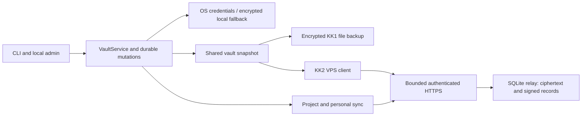

# S3 removal and VPS refactor

Status: development candidate **0.12.0**, not a published release. Baseline:
`7966581aa013326996fb479fb3fa38148681766b`. This follows the
[mutation and private-file hardening](HARDENING-2026-10-02.md).

## Scope

The supported paths are the local CLI/admin, encrypted file backup, KK2 VPS
compatibility sync, and KK3 project/personal sync. S3 sync and its browser
WebVault are removed. No new network service, framework or dependency is added.

## Removed code and retained behavior

Removed S3 components include its HTTP/SigV4 transport, config parser/model,
application service, CLI adapter, settings card, API handlers and automatic
worker mode. WebVault's account/session server, browser crypto implementation
and deployment image existed only for S3 and are removed with it. The
SessionStart sync hook is removed; existing project/personal OS schedules remain.

Snapshot serialization, complete-secret checks and deterministic merge now live
in `vault_snapshot.py`, independently of a transport. KK1 file export/import
and KK2 reuse them. The local `keys serve` browser UI remains available.
Merge collisions receive deterministic unique names within the existing length
limit. If renaming or tombstone replacement would redirect an existing
name-based reference to a different credential ID, the entire merge fails before
any local mutation or remote publication.

Old S3 commands return a fixed removal message before loading profiles, parsing
credential arguments or opening a backend. Authenticated obsolete API routes
return HTTP 410. Old `config.toml`, OS credential accounts and remote objects
are not modified or deleted. `doctor` can report that an obsolete config is
present without reading it. Explicit VPS commands continue to work when that
file exists.

The remaining `Entry`/`EntryType`, folder, project, scope and binding models
have live consumers in the local catalog, UI, validation, delivery and recovery.
Removing them would remove supported behavior; they are retained. Relative to
the preceding hardening commit, packaged source drops from 111 to 97 files and
from 35,831 to 32,464 lines; Python modules drop from 84 to 76. These are net
counts including the two small extracted shared modules, excluding tests,
bytecode and build caches.

## VPS client

The client verifies fresh membership and revocation records and signed history
on each operation. Historical snapshots are not needed to verify signed ancestry.
The existing APIs gain optional compact-history parameters while their default
responses remain compatible with older clients. The newest encrypted snapshot
still receives ciphertext-hash and AES-GCM validation before use. Older relays
remain supported through the per-record path: an older relay's rejection of the
optional history query gets one retry without that option. Signature, chain or
membership errors never downgrade verification. Work is bounded to 10,000
history records, a 60-second history deadline and a maximum of 20 retries
(default five). HTTP opener reuse is also bounded.

Full local snapshot preparation captures both the payload and its metadata
revision under the projection guard. A failed credential read aborts the
operation. A missing optional passphrase and an empty value are distinct; remote
wins can remove obsolete local passphrases. Concurrent local changes are checked
by the existing durable mutation boundary. Trust state is not republished when
unchanged, cannot regress, and checks concurrent replacement. Once enrollment
configuration is published, a later durability-confirmation error preserves
the matching credential bundle and reports uncertainty; a failure before
publication still compensates the credential writes.

## VPS relay

The default admission limit is two active application requests and 32 accepted
connections with a 10-second input deadline. Excess application work gets a
retryable HTTP 429 response. History listings project metadata and, when requested, signed commits in SQLite;
they do not select historical snapshot bodies. Shared bounded HTTP admission
covers both protocol versions, and shutdown closes idle connections. Contended
SQLite work fails with a fixed retryable error instead of occupying request
slots for the old 30-second busy wait.

Logical storage usage is maintained by SQLite triggers in the same transaction
as each insert/update/delete. Existing databases are counted once under the
writer lock; normal quota checks read two rows. There is no background
reconciliation process or mutable in-memory usage cache. KK2 and KK3 retain
separate accounting namespaces. Limits reject growth and never truncate signed
history. Control operations have reserved capacity.

Default logical limits are 512 MiB / 20,000 records per vault or scope and
2 GiB / 100,000 records per protocol namespace. Control operations have an
additional 32 MiB / 2,000 records per scope and 128 MiB / 10,000 globally.
Existing over-limit databases remain readable. Pairing retains its independent
expiry, packet, count and byte limits.

The relay creates a private database before SQLite writes its first page and
validates existing parents, database and sidecars. It refuses unsafe paths;
it does not silently chmod an operator-selected existing file. An older database
with broad permissions must be secured by its owner before startup. Read-only
backups remain a separate, explicit operation.

The container sends only allowlisted package inputs to its build context,
builds from selected sources, installs a wheel, runs as
an unprivileged user and uses a read-only root filesystem in Compose. The data
volume remains writable. Application admission and SQLite quotas bound work;
logical byte accounting is not a physical disk or RSS limit. Leave headroom for
indexes, SQLite pages and WAL. Production memory/CPU caps should follow workload
measurements rather than an arbitrary limit that could kill valid requests.

## Compatibility and limits

- KK1 encrypted files, KK2/KK3 cryptographic formats and project/personal
  enrollment remain supported. No automatic vault migration occurs.
- The relay still observes public identifiers, membership, sizes and timing.
  A compromised enrolled device retains secrets it already received. KK2
  revocation does not rotate its VaultKey; KK3 retains its existing epoch rekey.
- A malicious relay can deny service or maintain isolated valid views for
  devices without an independent witness. Signature and local checkpoint
  verification do not solve that separate threat.
- Private path checks protect against unsafe objects and permissions; they do
  not isolate the process from arbitrary code running as its own OS user.
- No live VPS deployment, operator vault diagnostic or credential read is part
  of these tests. All request, database and secret fixtures are synthetic.

## Measured resource behavior

These measurements use synthetic loopback traffic on macOS, with no live vault,
TLS or reverse proxy. They are evidence for the specific paths below, not a
production capacity guarantee or battery measurement. Exact counters and probe
conditions are recorded in [resource evidence](vps-resource-evidence-2026-10-02.json).

| Probe | Before / comparison | Current result |
|---|---|---|
| Client history: 205 commits, 2 KiB secret each | 207 HTTP requests, 205 snapshots, 1,147,869 response-body bytes | 6 requests, 1 snapshot, 243,146 bytes (79% fewer bytes) |
| Client history: 80 commits, 128 KiB secret each | 82 requests, 18,798,486 response-body bytes | 4 requests, 328,113 bytes (98% fewer bytes) |
| Same 80-commit client, cold verifier | 15,006,581 bytes peak traced Python allocations | 986,211 bytes (93% lower) |
| Quota check, 1 vs 500 stored records | Full per-table aggregate scans | 2 SELECTs and 32 SQLite VM instructions in both cases |
| Four simultaneous maximum-body requests, 16 MiB plaintext each | 4 active slots: 566.64 MiB peak server RSS | 2 active slots: 302.64 MiB peak server RSS, about 47% lower |
| Same maximum-body probe | One commit accepted, three CAS conflicts | One accepted, one CAS conflict, two fast 429 capacity responses |
| Idle project sync, 6 scopes × 3 cycles | Existing no-write contract | 0 journal writes, 0 changed encrypted files, 6 cold key derivations |

Client request counters use a synthetic transport and the preceding
`7966581` verifier, with only its shared-snapshot import adapted. Cold and
previously pinned clients produce the same request/byte counts. Memory is
`tracemalloc` after fixture creation, not native crypto allocation or total RSS;
the pinned client's traced peak is 1,051,618 bytes in the 80-commit case.

The admission comparison limits simultaneous work; it does not mean four
successful uploads finish twice as fast. Only one concurrent CAS writer can
win the same parent. Quotas count logical data, not indexes/WAL or process RSS.
The idle probe took about 1.48 seconds locally; retained key derivations are
one per scope, with fresh authenticated file reads preserved.

## Verification and distribution

Final focused validation passes: 67 enrollment/publication, signed-history,
reference-binding and public-contract cases; 103 snapshot/export/journal/storage
cases; and 124 relay/private-IO cases with one platform skip. These suites
partially overlap and must not be summed. The built 0.12.0 wheel installs into
a fresh environment and produces matching generated skills and references.
Canonical instruction, UI-token, JavaScript syntax and whitespace checks pass.

Full local validation uses `KEYS_KEEPER_TEST_NATIVE_CLIPBOARD=0 PYTHONPATH=src
.venv/bin/python -m pytest -q -o addopts=''`. Cross-platform release gates run
on [PR #21](https://github.com/kyzdes/keys-keeper-skill/pull/21): five OS/Python
suites, native ACL/Secret Service tests, macOS build, installed-wheel generation,
Docker build/start, updater regressions and complete Python coverage with the
existing 84% line / 69% branch floors. Use the checks on the exact current head;
the preceding hardening run is not evidence for this candidate. The PR validation
summary records final full-run outcomes. Local Docker startup is not claimed;
the Docker daemon was unavailable and image startup is delegated to CI.

Marketplace verification currently matches the latest published **v0.11.1**
commit `36df576ba403437d6352add265232bc01601cbae`, including its description.
The maintainer helper now checks both the description and immutable source pin;
its optional `--write` only edits the local manifest. It never commits, rebases
or pushes. Publishing a candidate and updating the marketplace pin are separate
from verifying the existing public release.
